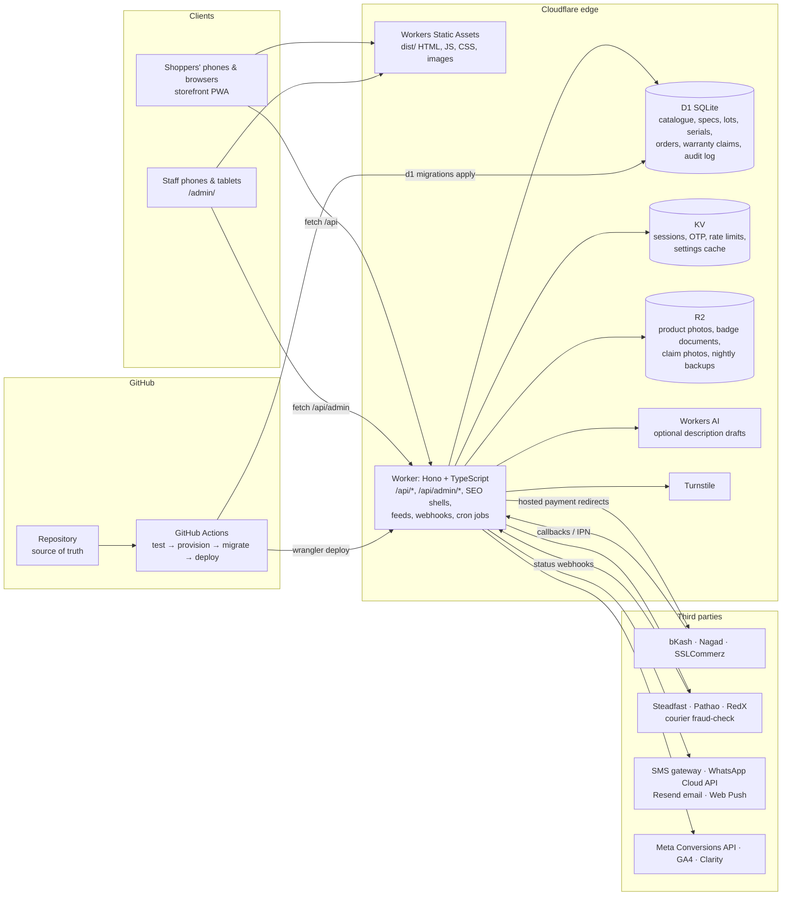
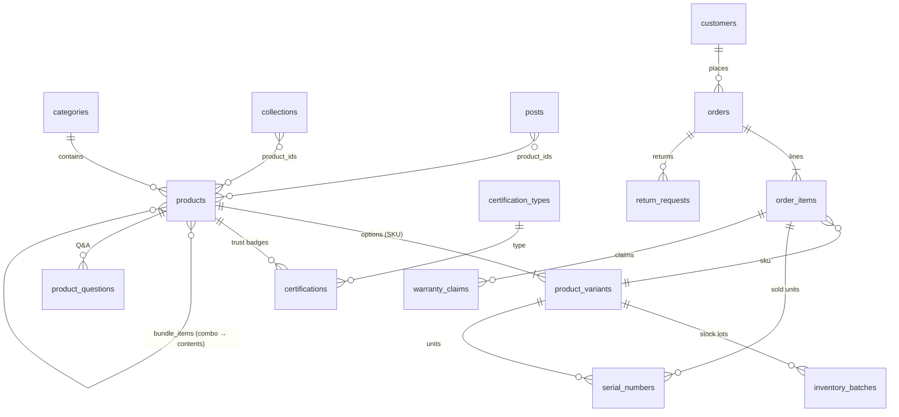
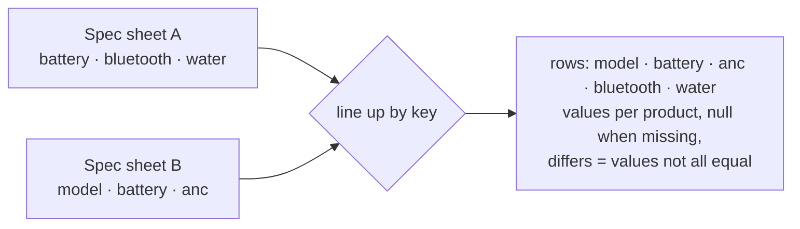
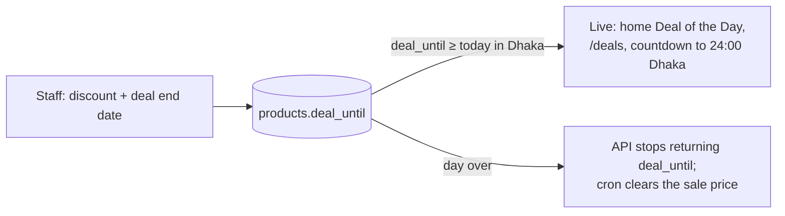
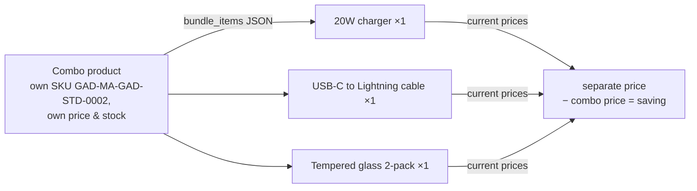
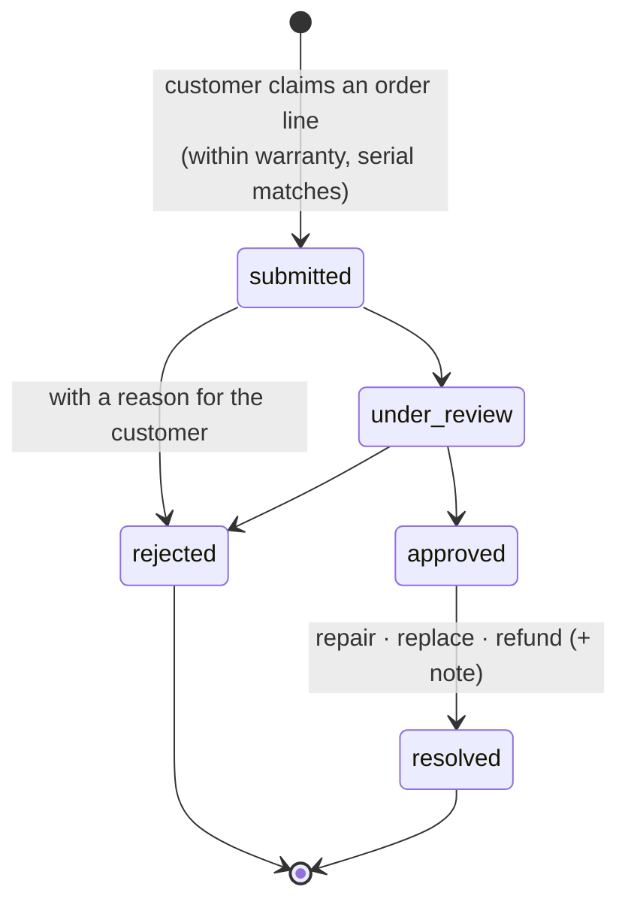
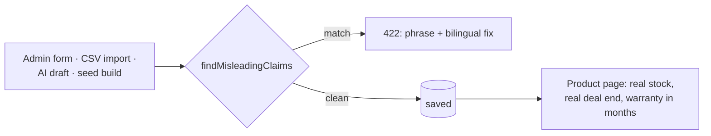
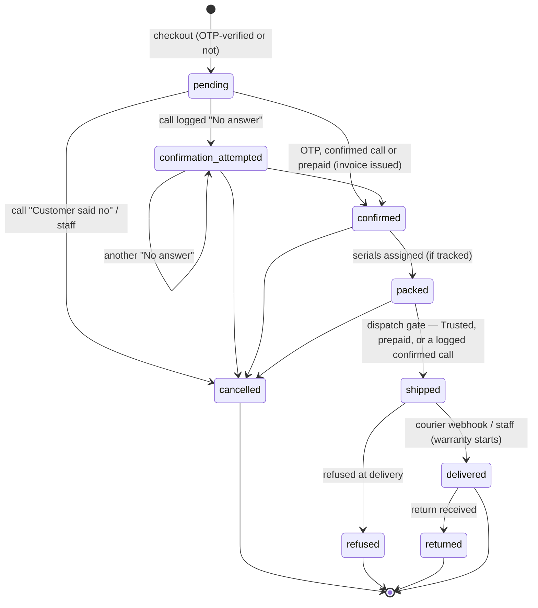
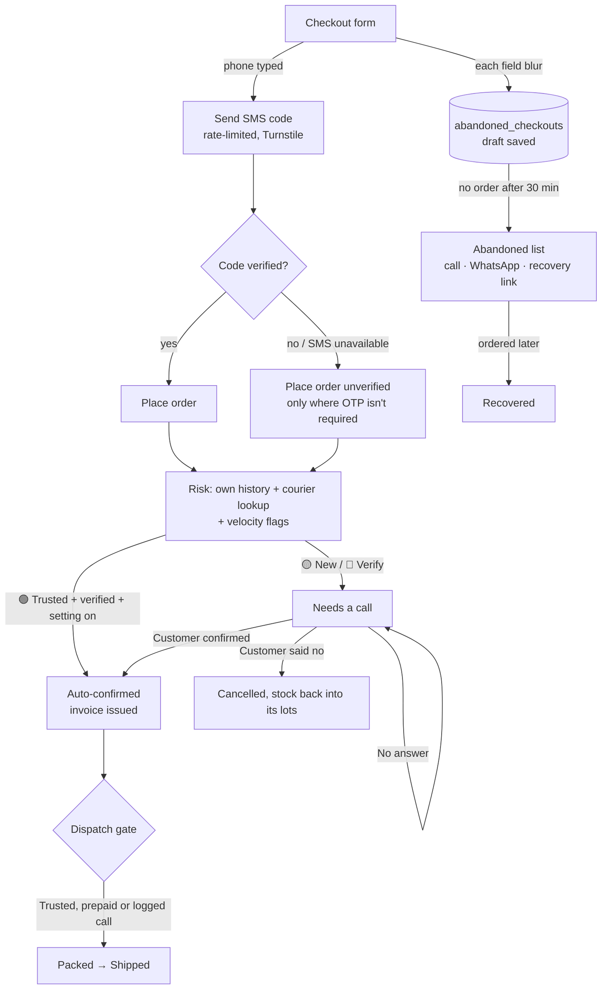

# Gadget Market — A–Z Specification

This document describes the system as built in this repository, section by section in the order of the build brief
([BUILD-PROMPT.md](BUILD-PROMPT.md)). Items marked **ADJUSTABLE** are defaults to confirm with the owner; the
[Assumptions](#assumptions) section lists everything that had to be assumed.

**Contents:** [1 Brand](#1-brand-market--business-requirements) · [2 Storefront](#2-public-website--description--layout) ·
[3 Admin](#3-admin-dashboard--description--layout) · [4 Architecture](#4-full-stack-architecture) · [5 Data models](#5-data-models) ·
[6 Integrations](#6-payments-delivery--third-party-integrations) · [7 Security](#7-security--compliance) · [8 Testing](#8-testing-strategy) ·
[9 Dashboard plan](#9-dashboard-development-plan) · [10 Folders](#10-file--folder-structure) · [11 Setup](#11-development-environment--deployment-setup) ·
[12 SEO & marketing](#12-seo-performance--marketing) · [13 Catalogue](#13-product-categories--content-plan) · [14 Roadmap](#14-phased-roadmap) ·
[15 Conventions](#15-development--delivery-conventions) · [16 Fraud & abandoned checkouts](#16-fraud-prevention--abandoned-checkout-capture) ·
[17 Ads & tracking](#17-marketing-ads--conversion-tracking) · [18 Premium](#18-additional-premium-features) · [19 Acceptance](#19-acceptance-checklist) ·
[20 Owner operations](#20-owner-friendly-operations--onboarding) · [API reference](#api-reference) · [Glossary](#glossary) · [Assumptions](#assumptions)

---

## 1. Brand, Market & Business Requirements

| | |
|---|---|
| Brand | **Gadget Market** / গ্যাজেট মার্কেট (the brief's "[Your Brand Name]"; **ADJUSTABLE** in `worker/src/brand.json`) |
| Tagline | *Smart gear. Honest specs.* — স্মার্ট গ্যাজেট, সৎ স্পেক |
| Location | Dhaka, Bangladesh — placeholder shop address on New Elephant Road, Dhaka 1205 and phone `+8801700000000` (**ADJUSTABLE** in `brand.json` and Admin → Settings → Store information) |
| Customers | Tech-savvy students and young professionals across Bangladesh, mostly on mid-range Android phones, reading Bangla and English |
| Scope | Gadgets & tech accessories: earbuds, headphones, speakers, smartwatches and straps, power banks, chargers, cables, phone cases, screen protectors, gaming accessories, smart-home gear, computer accessories, and combo bundles. Phones and laptops themselves are out of scope |
| Business model | Cash on Delivery by default; bKash / Nagad / Rocket; cards via SSLCommerz; gift-box add-on; combo bundles as their own stocked products; brand warranty passed through to the customer and handled by the shop |
| Logo direction | A cyan circuit-trace "G" in a rounded square on graphite — reads at 32 px (`public/img/logo.svg`, generated by `scripts/make-art.mjs`) |

- **Bilingual everywhere.** Bangla is the default; a বাংলা / English toggle is in the storefront header and the admin profile menu. Product names, descriptions, key features, in-the-box lists, spec labels, messages and every admin label exist in both languages. Spec *values* ("20000 mAh", "Bluetooth 5.3") stay as printed on the box.
- **Plain language, large touch targets** (≥ 44 px) for a small non-technical team.
- **Location** appears on About/Contact, the footer and the `ElectronicsStore` JSON-LD with the Dhaka address and coordinates.
- **Honest urgency (hard rule).** The **Deal of the Day** countdown runs to the deal's real end (`deal_until`, midnight Bangladesh time); the sale price ends by itself that night (`endExpiredDeals` in the cron) and the deal disappears from the API the moment it's over — the timer never resets. Stock counts are the real ones ("only X left" only when real stock ≤ the low-stock threshold). Copy with fabricated urgency or impossible promises is refused (see [the honest-copy guard](#the-honest-copy-guard)).
- **Warranty, written down.** Every product carries `warranty_months` (0 = none), shown as a badge with the **warranty terms** next to it (edited in one place: Admin → Settings → Store information). The months are copied onto each order line, printed on the invoice, and claims are checked against the delivery date.
- **Trust badges only with proof (hard rule).** Badge types (official brand warranty, BTRC type approved, authorised distributor, tested before dispatch …) are managed in Admin → Trust badges. A badge is shown **only when a document is on file** — the product's own (e.g. its BTRC approval) or a business-wide one on the type (e.g. a distribution letter) — and only while unexpired. Seed data ships **no** documents, so no badge shows until the owner attaches a real one.

## 2. Public Website — Description & Layout

**Style:** dark-first tech — near-black graphite (`#0D0E12`) with a faint circuit grid, cyan primary (`#22D3EE`) and electric-blue accent (`#3B82F6`), frosted-glass cards with hairline borders and a soft glow, sharp 6–8 px corners; *Space Grotesk* headings over *Inter* body text (*Hind Siliguri* in Bangla) and *JetBrains Mono* for prices, SKUs and spec values; photoreal product renders — no cartoon illustrations.

| Page | Route | Notes |
|---|---|---|
| Home | `/` | hero banners, trust strip, **category tiles**, **Deal of the Day** (live countdown to the real end, real stock left), new arrivals, best sellers (real `sold_count` only), **combo bundles**, **gadget-finder** teaser with device chips, **tech explainer** spotlight (GaN by default, editable), collections, trust-badge strip (only those held), **tech guides**, reviews (approved only), newsletter |
| Shop / category | `/shop`, `/shop/:category`, `/search?q=` | filters: category, **works with** (device), **bundles / single products**, brand, price, in stock, on sale, **Deal of the Day**; search covers names, tags and **spec sheets**; sort: newest, popularity, price ↑↓, rating |
| Deals | `/deals` | live Deal of the Day products only |
| Product | `/product/:slug` | gallery with zoom, **works-with chips**, **warranty badge** ("12-month warranty", from the delivery date), deal countdown when live, key features, **colour / option selector** with its own SKU, price and stock, real stock line, quantity, Add to cart / Buy now, **Add to compare**, trust badges with proof, **spec table**, **in the box**, setup / how to use, good to know, warranty terms, **Q&A** (answered questions; ask one), reviews, **bundle contents** (with links, quantities, "bought separately" price and the real saving) for combos, "Also in these combos", "Goes well with" (collections), related, back-in-stock "Notify me", wishlist |
| Spec comparison | `/compare?ids=` | 2–3 products side by side (from the compare tray, up to 3), rows lined up by spec name, differing rows highlighted, "only show differences" |
| Gadget finder | `/finder` | two questions (device → budget) → one in-stock essential from each shelf (audio, wearables, power, mobile accessories …) that works with it, within budget, plus matching ready-made combos; "Add all to cart" |
| Bundles | `/bundles` | all combo products |
| Collections | `/collections`, `/collections/:slug` | curated sets (iPhone essentials, laptop desk setup …) with combined price; "Add the collection" |
| Tech guides | `/guides`, `/guides/:slug` | buying guides (claims-checked) with the products they mention; `Article` JSON-LD |
| Cart / Checkout | `/cart`, `/checkout` | guest checkout; Division → District → Upazila/Thana; delivery charge auto-calculated from the area (or "Free delivery"); **gift box** with its fee, gift message; COD / bKash / Nagad / Rocket / card; SMS OTP; coupon or referral code |
| Order | `/order/:orderNo`, `/track` | status timeline, courier tracking, totals incl. gift box, invoice PDF once confirmed, review form after delivery |
| Account | `/account/(orders\|regulars\|wishlist\|addresses\|returns\|warranty\|referral\|profile)` | order history & tracking, **buy again** (cables and chargers get lost), wishlist, saved addresses, return requests, **warranty**: every delivered item with its warranty end date and serial, and a claim form tied to the order line; referral code |
| Campaign page | `/lp/:slug` | nav-free: one hero, one offer, one button |
| Info | `/about`, `/contact`, `/policy/(returns\|delivery\|privacy\|warranty)` | the warranty policy page shows the warranty terms |

Address data comes from [bayeziddev/Bangladesh-geocode](https://github.com/bayeziddev/Bangladesh-geocode) (8 divisions, 64 districts, upazilas), supplemented with Dhaka and Chattogram city thanas (`scripts/build-geo.mjs` → `public/data/bd-geo.json`).

## 3. Admin Dashboard — Description & Layout

Dark theme to match the shop: graphite surfaces, hairline borders, a cyan-blue gradient on primary buttons, a blue rail on the active menu item, monospace numbers and SKUs.

```
┌──────────────────┬──────────────────────────────────────┬──────────────────────┐
│ Left sidebar     │ Work area                             │ Right rail           │
│ (collapsible)    │  Dashboard: setup checklist,          │  Global search       │
│ Dashboard        │  Health Check, Needs your attention,  │  Profile menu        │
│ Products         │  KPIs, monthly chart, recent orders,  │  Notifications bell  │
│ Categories       │  top sellers                          │  Staff online now    │
│ Orders  (7)      │  Lists open detail in a slide-over    │                      │
│ Customers        │                                       │                      │
│ Coupons          │                                       │                      │
│ Warranty claims  │                                       │                      │
│ Inventory        │                                       │                      │
│ Reports          │                                       │                      │
│ … Staff · Settings · Help                                │                      │
└──────────────────┴──────────────────────────────────────┴──────────────────────┘
```

Sidebar — the brief's order first, then operations: **Dashboard · Products · Categories · Orders · Customers · Coupons · Warranty claims · Inventory · Reports** · *Sales:* Abandoned checkouts · Returns & refunds · Product Q&A · Reviews · *Marketing:* Collections · Tech guides · Campaign pages · Banners & logo · Referrals · Trust badges · *System:* Delivery zones · Activity log · **Staff & roles · Settings · Help**. Orders, abandoned checkouts, open warranty claims and unanswered questions show a count. On phones the sidebar and rail become drawers; tables become stacked cards.

| Module | What staff can do |
|---|---|
| Dashboard | first-run checklist, Health Check strip, "Needs your attention today" (calls to make, mobile payments, **warranty claims to handle**, **questions to answer**, abandoned, returns, back-in-stock, dated lots expiring, low stock, reviews), KPIs (**today's orders**, **today's sales**, this month, **cash still to collect (COD)**, **low stock**, abandoned, **open warranty claims**, **combos sold**), monthly chart (Chart.js; numbers table if it can't load) |
| Products | list with brand, devices, bundle and live-deal markers, stock health, warranty, badges, waiting and unanswered-question counts; filters by category, **works with**, **bundles / single products**, status, stock, **Deal of the Day**, **no spec sheet**; editor: bilingual copy, category, brand, **devices it works with**, **warranty months**, origin, price & discount, **Deal of the Day end date** (needs a discount), photos, options (option label + **colour**) with auto SKUs and serials on the shelf, **spec sheet** (key/value rows; standard names from a list line up in the comparison; reorder), **key features** (up to 4), **in the box**, bundle contents (product picker with quantities and the "bought separately" price; no bundles inside bundles), trust badges (pick a type, optional document, issuer, number, expiry), descriptions, setup / how to use, good to know, SEO; AI draft from the spec sheet with a preview including the warranty terms; duplicate, Trash, CSV import/export (claims-checked), notify waiting |
| Categories | nested tree, drag to reorder / nest, 2–3-letter SKU code per category; Active ⇄ Inactive switch; CSV |
| Orders | tabs incl. 📞 *Needs a call*; filters (payment, risk, date, warnings), CSV; bulk Confirm / Packed / Shipped with confirmation; detail with pipeline, gates, risk + reason, courier history, one-tap call / WhatsApp templates, call outcome buttons, warranty months per line, **"Pack from lot PO-2608-011 ×2"**, **serial numbers per line** (pick from the shelf or scan; one per unit), gift-box instruction and message, ship dialog, invoice PDF, shipping label, refunds, notes, Trash |
| Customers | order counts, 🟢/🟡/🔴 badge with reason, block/unblock, CSV |
| Coupons | flat/percent/free delivery, minimum order, expiry, usage limits, per-customer limit; recovery & referral coupons listed |
| Warranty claims | open / by status / search, CSV; detail: claim number, order and invoice, product, warranty end date, the serials we sent, the customer's issue and photo, earlier claims from the same phone, history; move **Submitted → Under review → Approved / Rejected → Resolved** (repair / replace / refund) with a note for the customer (SMS) and a staff note; replace or refund marks the old serial faulty |
| Inventory | per-SKU stock with serials on the shelf, ±1/+5 and bulk set, reason, stock history, waiting list, *Units without a serial* filter, CSV; **Stock lots**: receive stock by lot (supplier invoice no., quantity, cost, supplier, optional expiry for dated items, optional serials), write off damaged units, CSV; **Serial numbers**: log serials for units on the shelf, search by serial / SKU / order, mark faulty, CSV |
| Reports | sales by day/month/category/product/payment/zone/**ad campaign**, best sellers by SKU, delivery outcomes, best customers, checkout funnel, **warranty claims by product** (claims, repaired / replaced / refunded, claim rate against units sold) — all CSV |
| Abandoned checkouts | to follow up / still filling in / recovered / not interested; call, WhatsApp, send recovery link; CSV |
| Returns & refunds | approve → item received (order becomes Returned; **not restocked automatically** — inspect first) → refund sent; reasons incl. *not working*, *not as described*, *wrong item*; reject with reason; CSV |
| Product Q&A | new questions from product pages; answer → published on the product page; hide; delete |
| Trust badges | badge types: name, code, **icon**, issuer, **optional business-wide document** (PDF/photo), valid until, description; shows whether proof is on file and how many products use it; CSV |
| Collections · Tech guides · Campaign pages · Banners & logo · Referrals · Reviews | curated sets (optionally for one device); buying guides (claims-checked); landing pages for ads; hero / offer / marketing / popup banners with schedule; logo upload; referral codes; approve / reject / reply to reviews |
| Staff & roles | Super Admin, Manager, Order Processor, Read-only Viewer; phone for SMS sign-in; reset 2FA |
| Settings | store information (incl. **the warranty terms — English and Bangla, one place**, gift box on/off and fee, dated-lot warning window, **tech explainer spotlight**), payments, customer messages (incl. warranty-claim SMS), WhatsApp quick replies, fake-order protection, abandoned checkouts, automatic messages, VAT, refer-a-friend, ads & tracking, connected services & backups |
| Delivery zones · Activity log · Help center | fees by area; who did what; short guides incl. adding a product with a spec sheet, running a Deal of the Day, bundles, receiving stock with serials, handling a warranty claim, why a description was refused |

**CRUD rules:** slide-over forms, inline bilingual validation messages from the API (a refused phrase is named with a suggested fix), confirmation before delete (soft delete → Trash → restore), toasts for success/failure, actions hidden when the role lacks permission (and refused by the API anyway), search/filter/pagination on every list, loading / empty / error states on every view.

## 4. Full-Stack Architecture



- **Static first:** `run_worker_first` lists only dynamic paths (`/api/*`, `/media/*`, `/product/*`, `/shop/*`, `/guides/*`, feeds, `/wa`, `/lp/*`, sitemap, robots). Everything else is served from the edge without invoking the Worker.
- **SEO shells:** for `/product/:slug`, `/shop/:slug`, `/guides/:slug` and `/lp/:slug` the Worker streams `index.html` through `HTMLRewriter` to inject the title, meta description, canonical, Open Graph/Twitter tags and JSON-LD (`Product` with `brand`, `sku`, `offers`; `Article` …), then the SPA takes over. An unknown slug gets the app shell with a **404** status.
- **Transactions:** D1 `batch()` is atomic — order + items (with their warranty months) + stock decrement + **lot allocations** + history are one batch; counters use `UPDATE … RETURNING`.
- **Cron:** `*/10 * * * *` — abandoned detection/recovery, retention purge, review requests, **ending expired deals** (clears the sale price of products whose `deal_until` has passed), write-off of expired dated lots; `0 21 * * *` (03:00 Dhaka) — nightly backup to R2.

## 5. Data Models

`worker/migrations/0001_init.sql` creates all 37 tables (including `inventory_batches`, `serial_numbers`, `warranty_claims`, `product_questions`, `certification_types`, `posts`, and the gadget fields on `products` — `compatible`, `specs`, `highlights`, `in_box_en/bn`, `warranty_months`, `deal_until`, `bundle_items` — `warranty_months` on `order_items` and `device` on `collections`). The tables below are generated from it. Money is stored as whole Taka (`INTEGER`), timestamps as ISO-8601 UTC text, booleans as `0/1`, dates (deal end, expiry, warranty end) as `YYYY-MM-DD`. "Day" boundaries in reports, deals, expiry checks, claim and invoice numbers use Bangladesh time (UTC+6).



### SKU and invoice numbering (hard requirement)

| | Format | Example | How it's generated | Uniqueness |
|---|---|---|---|---|
| SKU (per colour / option) | `GAD-[Cat]-[Brand]-[Color]-[Seq]` | `GAD-EB-SON-BLK-0001`, `GAD-PB-VOL-MID-0005`, `GAD-CB-VOL-STD-0003`, `GAD-MA-GAD-STD-0002` (a combo) | on product save, blank SKUs get the next number from the `counters` row `sku:<CAT>`; `[Cat]` is the category's 2–3-letter code, `[Brand]` the first three letters of the brand (`GEN` when none), `[Color]` a 3-letter colour code (`BLK`, `WHT`, `GRY`, `MID` …; first three letters for others; `STD` when the option has no colour); staff may type their own; the form previews the next SKU | `UNIQUE INDEX uq_variants_sku`; a clash returns a plain message |
| Order number | `GMK-YYMMDD-XXXX` | `GMK-261001-VA3H` | at checkout (random suffix — not guessable from the previous order) | `UNIQUE` |
| Invoice number | `INV-GAD-YYYYMMDD-####` | `INV-GAD-20261001-0001` | **at confirmation** only; sequential per Bangladesh day via `counters` row `inv:YYYYMMDD` (`UPDATE … RETURNING`, atomic); idempotent — an order keeps its number | partial `UNIQUE INDEX` on `invoice_no` |
| Warranty claim | `WC-YYMMDD-####` | `WC-261002-0001` | when the customer submits a claim; sequential per Bangladesh day (`counters` row `wc:YYMMDD`) | `UNIQUE` |

The PDF invoice (`GET /api/orders/:orderNo/invoice.pdf?token=…` for the customer, `GET /api/admin/orders/:id/invoice.pdf` for staff) lists SKU, item, option / colour, **the warranty for each line ("Warranty: 1 year") and its serial numbers ("S/N: …")**, the stock lot, quantity, unit price, line total, subtotal, discount (coupon/referral), delivery fee, gift box and its fee, optional VAT line with BIN, total, payment method, COD amount to collect, the gift message and **the store's warranty terms**. Dates on it are Bangladesh dates, matching the invoice number.

### Specs, compatibility and comparison

- `products.specs` is an ordered JSON list `[{key, value}]`. Keys from the standard list (`worker/src/lib/codes.ts` → `SPEC_KEYS`: model, battery, capacity, playtime, charging time, output / wattage, input, ports, connectivity, Bluetooth, range, driver, noise cancelling, microphone, display, sensors, water resistance, length, material, dimensions, weight, compatibility) show a bilingual label and line up across products; other keys show as typed. Values are kept exactly as printed ("IPX4 (sweat and splashes)"). A spec can't be listed twice, and a product can't be published without a spec sheet.
- `products.compatible` is stored as `,iphone,usb_c,` so `LIKE '%,usb_c,%'` matches one exact device code. The codes (`COMPATIBLE`): `iphone`, `android`, `usb_c`, `lightning`, `laptop`, `mac`, `windows`, `ps5`, `xbox`, `switch`, `smart_tv` — they drive the "Works with" filter and chips, collections per device and the gadget finder.
- `GET /api/compare?ids=1,2[,3]` returns the cards and one row per spec key — standard keys in the standard order, then the rest — with each product's value (or `null`) and `differs` when they aren't all the same.



### Deal of the Day (honest urgency)



- A deal needs a real sale price or discount (`productSchema`), and its end is a date: the countdown targets 24:00 Bangladesh time on that day (`Date.UTC(y, m-1, d, 18)`).
- "Live" is one SQL condition used everywhere (`DEAL_LIVE_SQL`: `deal_until >= date('now', '+6 hours')`), so the list, the home page and the product page agree; after the day ends `deal_until` is no longer exposed and `endExpiredDeals` clears the sale price and the date.
- The deal card shows the real stock left; there is no "people viewing" counter.

### Combo bundles



- A combo is an ordinary product with `bundle_items = [{product_id, quantity}]`. It is **packed and stocked as one box**, so it has its own variants, lots, price and stock; buying a combo never touches the stock of the products inside.
- The product page lists what's inside with links and quantities, the **separate price computed from current prices** and the saving — never an invented "worth" figure. Every product inside shows "Also in these combos". The build refuses a starter combo that doesn't save money.
- Rules (API + form): at least 2 different products; quantities 1–20; contents must exist and not be in Trash; **no combos inside combos**; a combo can't contain itself; a product that is inside a combo can't become one.

### Trust badges

- `certification_types` — `code`, bilingual name and description, `icon` (`shield | check | star | flask | leaf | drop | crescent`), `issuer`, optional **business-wide** `document_url` + `valid_until`. Seeded: `official_warranty`, `btrc`, `authorised`, `qc_tested`.
- `certifications` — per product: `type` (foreign key to `certification_types.code`), issuer, certificate number, optional `document_url`, `valid_until`, `is_active`.
- **Shown only with proof:** a product badge appears when it is active, the type is active, and either the product row has a document or the type has an unexpired business-wide document — and the product's own `valid_until` (if any) hasn't passed (`HELD_CERT_SQL`). The home-page and About-page strip lists types with a business-wide document on file (`HELD_TYPE_SQL`).

### Stock lots and serial numbers

```mermaid
flowchart LR
  R[Receive stock<br/>lot no. + qty + cost<br/>(+ expiry if dated)] --> B[(inventory_batches)]
  R -.optional.-> SN[(serial_numbers<br/>in_stock)]
  B -->|checkout: dated lots by expiry,<br/>others oldest first| O[order_items.batches]
  SN -->|packing: one serial per unit| OI[order line · status sold]
  O -->|cancelled / refused| B
  OI -->|warranty: replace / refund| F[serial → faulty]
```

- `product_variants.stock` stays the sellable total; `inventory_batches.qty_remaining` says which lots it is in. Lots without an expiry are stored with `expiry_date = '2099-12-31'` (`NO_EXPIRY`), so the same ordering — `expiry_date, id` — ships dated lots first-expiring-first and everything else oldest-lot-first. Stock without a lot still sells.
- Cancelled and refused parcels were never opened, so their units go back into the **same** lots. Returned items are not restocked automatically: staff inspect them and add a sealed unit back by hand or write it off.
- Manual stock decreases take units off the newest lots, so lot counts never exceed stock (`reconcileVariantBatches`). Dated lots that expire leave sellable stock in the nightly job.
- **Serial numbers are optional per option** (high-value items). Logged serials (`in_stock`) can't exceed the units on the shelf and are unique across the shop. When packing, staff give each unit on an order line a serial (`PUT /api/admin/order-items/:id/serials` — one per unit, same option, on the shelf); they become `sold`, are printed on the invoice and are checked when a claim comes in. Taking a serial off a line puts it back on the shelf.

### Warranty claims



- A customer can claim any item of a **delivered** order with `warranty_months > 0` while `warranty_until = delivered date + months` (end of a shorter month clamps, `warrantyUntil()`) hasn't passed. If serials were logged for that line, the claim must name one of them (one unit → filled in automatically). One open claim per order line.
- Staff move a claim only along the arrows (`CLAIM_FLOW`); *Rejected* needs a note for the customer, *Resolved* needs a resolution. Every step can send an SMS (`claim_received`, `claim_update` templates) and is in the activity log. A *replace* or *refund* marks the original serial `faulty` so it can't be sold again.
- Reports → *Warranty claims by product* shows claims per product with the claim rate against units sold in the same period.

### The honest-copy guard



Rules (English and Bangla, `worker/src/lib/claims.ts`) refuse: fabricated urgency typed into copy ("only 2 left", "15 people viewing", "selling fast", "offer ends today"), "lifetime warranty / guarantee", "100% / fully waterproof" (and "waterproof" without an IP rating in the same sentence), "unbreakable / indestructible / never overheats", "guaranteed / 100% original / genuine / safe", "best / cheapest in Bangladesh", and the Bangla equivalents (মাত্র ২টি বাকি, জন দেখছেন, লাইফটাইম / আজীবন ওয়ারেন্টি, ১০০% ওয়াটারপ্রুফ, ভাঙবে না, দেশের সবচেয়ে সস্তা). Ordinary words stay allowed: "water resistant (IPX5)", "waterproof to IP68 (1.5 m, 30 min)", "12-month warranty", "fast charging", "original". It checks product names, descriptions, setup text, key features, **spec values**, collection, guide, banner and landing copy, the tech-explainer spotlight, CSV imports and AI drafts. The build fails if starter copy matches, and a unit test runs every starter product, bundle, guide, collection and banner through it.

### Gadget finder

`GET /api/finder?device=&budget=` takes active, in-stock, non-bundle products tagged with the device, groups them by top-level category (shelf), and `pickSetup()` picks the best match from up to 4 shelves — featured, best rated and best selling first, in the shop's category order — while keeping enough budget in reserve for the cheapest option of the remaining shelves; if that's impossible it takes the cheapest item that still fits. It also returns ready-made combos for the device within budget and a short explanation reminding the shopper to check "Works with" and the wattage on each spec sheet.

### Worked example — the Order model

```ts
/** Order as returned by the admin API (camelCase view of the `orders` + `order_items` rows). */
type OrderStatus =
  | "pending" | "confirmation_attempted" | "confirmed" | "packed" | "shipped" | "delivered"
  | "cancelled"   // stopped before shipping — stock back into its lots
  | "refused"     // courier attempted delivery, customer declined — stock back into its lots
  | "returned";   // accepted, then sent back — inspected before it goes back on sale

interface LotAllocation {
  batchId: number;
  batchNo: string;             // "PO-2608-011" — supplier invoice / lot number
  expiry: string;              // "2099-12-31" for lots that don't expire
  qty: number;
}

interface OrderLineItem {
  sku: string;                 // e.g. "GAD-EB-SON-BLK-0001" — copied onto the line so later edits never change history
  productId: number;
  variantId: number;
  nameEn: string;
  nameBn: string;
  size: string;                // option label: "Standard", "2 m", "iPhone 15 Pro" …
  color: string;               // "Black", "Midnight Blue" …
  warrantyMonths: number;      // copied at checkout — what the customer bought, even if the product changes later
  batches: LotAllocation[];    // which lots to pick
  serials: string[];           // filled in when packed (only for options with logged serials)
  quantity: number;
  unitPrice: number;           // Taka, after product discount / live deal
  lineTotal: number;
}

interface Order {
  id: number;
  orderNo: string;             // "GMK-261001-VA3H" — given at checkout
  invoiceNumber: string | null;// "INV-GAD-20261001-0001" — null until the order is confirmed
  status: OrderStatus;
  customer: { name: string; phone: string; email?: string };
  address: { division: string; district: string; upazila: string; area: string; zoneCode: string };
  items: OrderLineItem[];
  subtotal: number;
  discount: number;
  deliveryFee: number;
  giftWrap: boolean;           // gift box with a card
  giftWrapFee: number;         // Taka, from Settings → Store information (0 = free)
  giftMessage?: string;
  vatAmount: number;           // 0 unless VAT is switched on in Settings
  total: number;
  couponCode?: string;
  referralCode?: string;
  paymentMethod: "COD" | "bKash" | "Nagad" | "Rocket" | "Card";
  paymentStatus: "pending" | "paid" | "failed" | "refunded" | "partially_refunded";
  paymentRef?: string;         // bKash/Nagad TrxID or gateway reference
  otpVerified: boolean;
  confirmationMethod?: "prepaid" | "call" | "otp" | "trusted";
  riskLevel: "low" | "medium" | "high"; // shown as 🟢 Trusted / 🟡 New / 🔴 Verify before shipping
  flags: ("velocity_phone" | "velocity_address" | "velocity_ip")[];
  courier?: { partner: "Steadfast" | "Pathao" | "RedX"; trackingId?: string; status?: string };
  utm?: { source?: string; medium?: string; campaign?: string };
  adRef?: string;              // click-to-WhatsApp / ad identifier
  createdAt: string;
  confirmedAt?: string;
  shippedAt?: string;
  deliveredAt?: string;        // the warranty runs from this date
}
```

Response of `POST /api/orders` (fixture `tests/fixtures/create-order.response.json`):

```json
{
  "orderNo": "GMK-261001-7K2Q",
  "status": "pending",
  "total": 5980,
  "purchaseEventId": "purchase-GMK-261001-7K2Q",
  "items": [{ "sku": "GAD-EB-SON-BLK-0001", "name": "Sonix Buds Pro ANC Earbuds", "quantity": 2, "price": 2990 }]
}
```

### Order lifecycle



Stock goes back (into the same lots) for **cancelled** and **refused**; **returned** units are inspected before they go back on sale. Only **refused** and **returned** count against a customer's risk.
Courier sub-statuses (e.g. *Out for delivery*) are stored in `courier_status` and shown to the customer without changing the main status.

### Tables

The tables the brief names (`products`, `product_variants`, `categories`, `orders`, `order_items`, `customers`, `addresses`,
`wishlist`, `reviews`, `coupons`, `admins`, `inventory_log`, `inventory_batches`, `serial_numbers`, `warranty_claims`,
`delivery_zones`), the trust-badge types, buying guides (`posts`), product Q&A and collections, and those added for
sections 16–18 (`abandoned_checkouts`, `order_confirmation_attempts`, `return_requests`, `stock_notify_requests`,
`referral_codes`, `marketing_events`) are all below, generated from the migration (column notes are its SQL comments).

#### `settings`

| Column | Type | Constraints / default | Notes |
|---|---|---|---|
| `key` | TEXT | PRIMARY KEY |  |
| `value` | TEXT | NOT NULL |  |
| `updated_at` | TEXT | NOT NULL DEFAULT (now) |  |

#### `counters`

| Column | Type | Constraints / default | Notes |
|---|---|---|---|
| `name` | TEXT | PRIMARY KEY |  |
| `value` | INTEGER | NOT NULL DEFAULT 0 |  |

#### `admins`

| Column | Type | Constraints / default | Notes |
|---|---|---|---|
| `id` | INTEGER | PRIMARY KEY AUTOINCREMENT |  |
| `name` | TEXT | NOT NULL |  |
| `email` | TEXT | NOT NULL UNIQUE | sign-in ID: email or simple username |
| `phone` | TEXT | UNIQUE | used for phone + OTP sign-in (staff roles) |
| `password_hash` | TEXT |  |  |
| `role` | TEXT | NOT NULL CHECK (role IN ('super_admin','manager','order_processor','viewer')) |  |
| `is_active` | INTEGER | NOT NULL DEFAULT 1 |  |
| `totp_secret` | TEXT |  | base32, set during 2FA setup |
| `totp_enabled` | INTEGER | NOT NULL DEFAULT 0 |  |
| `last_login_at` | TEXT |  |  |
| `last_seen_at` | TEXT |  |  |
| `created_at` | TEXT | NOT NULL DEFAULT (now) |  |
| `updated_at` | TEXT | NOT NULL DEFAULT (now) |  |
| `deleted_at` | TEXT |  |  |

#### `categories`

| Column | Type | Constraints / default | Notes |
|---|---|---|---|
| `id` | INTEGER | PRIMARY KEY AUTOINCREMENT |  |
| `parent_id` | INTEGER | REFERENCES categories(id) |  |
| `slug` | TEXT | NOT NULL UNIQUE |  |
| `code` | TEXT | NOT NULL | 2–3 letters used in SKUs, e.g. EB (earbuds), PB (power banks) |
| `name_en` | TEXT | NOT NULL |  |
| `name_bn` | TEXT | NOT NULL |  |
| `description_en` | TEXT |  |  |
| `description_bn` | TEXT |  |  |
| `image_url` | TEXT |  |  |
| `color` | TEXT |  | tile tone key: yellow\|mint\|lavender\|peach\|sky\|pink (shown as earthy tints) |
| `sort_order` | INTEGER | NOT NULL DEFAULT 0 |  |
| `is_active` | INTEGER | NOT NULL DEFAULT 1 |  |
| `created_at` | TEXT | NOT NULL DEFAULT (now) |  |
| `updated_at` | TEXT | NOT NULL DEFAULT (now) |  |
| `deleted_at` | TEXT |  |  |

index `idx_categories_parent` (parent_id, sort_order)  

#### `products`

| Column | Type | Constraints / default | Notes |
|---|---|---|---|
| `id` | INTEGER | PRIMARY KEY AUTOINCREMENT |  |
| `slug` | TEXT | NOT NULL UNIQUE |  |
| `name_en` | TEXT | NOT NULL |  |
| `name_bn` | TEXT | NOT NULL |  |
| `description_en` | TEXT |  |  |
| `description_bn` | TEXT |  |  |
| `category_id` | INTEGER | REFERENCES categories(id) |  |
| `brand` | TEXT |  |  |
| `price` | INTEGER | NOT NULL CHECK (price > 0) |  |
| `sale_price` | INTEGER |  |  |
| `discount_type` | TEXT | NOT NULL DEFAULT 'none' CHECK (discount_type IN ('none','percent','flat')) |  |
| `discount_value` | INTEGER | NOT NULL DEFAULT 0 |  |
| `compatible` | TEXT | NOT NULL DEFAULT '' | Devices it works with, stored as ",iphone,usb_c," so a LIKE '%,iphone,%' filter is exact (see lib/sku.ts COMPATIBLE). |
| `specs` | TEXT | NOT NULL DEFAULT '[]' | The spec sheet: JSON [{key, value}] in display order. Known keys (battery, wattage, ports …) get bilingual labels. |
| `highlights` | TEXT | NOT NULL DEFAULT '[]' | JSON [{name, benefit_en, benefit_bn}] — key features called out on the page |
| `in_box_en` | TEXT |  | what's in the box, one item per line |
| `in_box_bn` | TEXT |  |  |
| `how_to_use_en` | TEXT |  | setup / how to use, one step per line |
| `how_to_use_bn` | TEXT |  |  |
| `caution_en` | TEXT |  | safety notes, e.g. "Use a 20W-or-higher adapter" |
| `caution_bn` | TEXT |  |  |
| `warranty_months` | INTEGER | NOT NULL DEFAULT 0 CHECK (warranty_months BETWEEN 0 AND 60) | 0 = no warranty |
| `origin` | TEXT |  | brand origin / made in, e.g. "Made in China · Official BD import" |
| `deal_until` | TEXT |  | Deal of the Day: while deal_until is in the future the sale price applies and the home page counts down to it. A deal that has ended is cleared by the frequent job and never priced, so the countdown is never made up. |
| `bundle_items` | TEXT | NOT NULL DEFAULT '[]' | JSON [{product_id, quantity}] — empty for ordinary products |
| `delivery_mode` | TEXT | NOT NULL DEFAULT 'zone' CHECK (delivery_mode IN ('zone','free')) |  |
| `tags` | TEXT | NOT NULL DEFAULT '' |  |
| `images` | TEXT | NOT NULL DEFAULT '[]' |  |
| `status` | TEXT | NOT NULL DEFAULT 'draft' CHECK (status IN ('draft','active','archived')) |  |
| `is_featured` | INTEGER | NOT NULL DEFAULT 0 |  |
| `sold_count` | INTEGER | NOT NULL DEFAULT 0 |  |
| `rating_avg` | REAL | NOT NULL DEFAULT 0 |  |
| `rating_count` | INTEGER | NOT NULL DEFAULT 0 |  |
| `meta_title` | TEXT |  |  |
| `meta_description` | TEXT |  |  |
| `created_at` | TEXT | NOT NULL DEFAULT (now) |  |
| `updated_at` | TEXT | NOT NULL DEFAULT (now) |  |
| `deleted_at` | TEXT |  |  |

index `idx_products_list` (status, deleted_at, category_id)  
index `idx_products_created` (created_at)  

#### `product_variants`

| Column | Type | Constraints / default | Notes |
|---|---|---|---|
| `id` | INTEGER | PRIMARY KEY AUTOINCREMENT |  |
| `product_id` | INTEGER | NOT NULL REFERENCES products(id) ON DELETE CASCADE |  |
| `sku` | TEXT | NOT NULL |  |
| `size` | TEXT | NOT NULL DEFAULT 'Standard' | the option: model, capacity, wattage, length … e.g. "20W", "1.2 m", "10000 mAh" |
| `color` | TEXT | NOT NULL DEFAULT '' | part of the SKU (BLK, WHT, BLU …) |
| `stock` | INTEGER | NOT NULL DEFAULT 0 CHECK (stock >= 0) |  |
| `price_override` | INTEGER |  |  |
| `low_stock_threshold` | INTEGER | NOT NULL DEFAULT 3 |  |
| `sort_order` | INTEGER | NOT NULL DEFAULT 0 |  |
| `created_at` | TEXT | NOT NULL DEFAULT (now) |  |
| `updated_at` | TEXT | NOT NULL DEFAULT (now) |  |

unique index `uq_variants_sku` (sku)  
index `idx_variants_product` (product_id, sort_order)  

#### `certification_types`

| Column | Type | Constraints / default | Notes |
|---|---|---|---|
| `id` | INTEGER | PRIMARY KEY AUTOINCREMENT |  |
| `code` | TEXT | NOT NULL UNIQUE | official_warranty, btrc, authorised … (lowercase) |
| `name_en` | TEXT | NOT NULL |  |
| `name_bn` | TEXT | NOT NULL |  |
| `description_en` | TEXT |  |  |
| `description_bn` | TEXT |  |  |
| `icon` | TEXT | NOT NULL DEFAULT 'shield' | leaf \| shield \| flask \| crescent \| check \| star \| drop |
| `issuer` | TEXT |  | who certified the business, e.g. "BSTI", "Islamic Foundation" |
| `document_url` | TEXT |  | the business-wide certificate (PDF / photo) |
| `document_name` | TEXT |  |  |
| `valid_until` | TEXT |  |  |
| `sort_order` | INTEGER | NOT NULL DEFAULT 0 |  |
| `is_active` | INTEGER | NOT NULL DEFAULT 1 |  |
| `created_at` | TEXT | NOT NULL DEFAULT (now) |  |
| `updated_at` | TEXT | NOT NULL DEFAULT (now) |  |
| `deleted_at` | TEXT |  |  |

#### `certifications`

| Column | Type | Constraints / default | Notes |
|---|---|---|---|
| `id` | INTEGER | PRIMARY KEY AUTOINCREMENT |  |
| `product_id` | INTEGER | NOT NULL REFERENCES products(id) ON DELETE CASCADE |  |
| `type` | TEXT | NOT NULL REFERENCES certification_types(code) ON UPDATE CASCADE |  |
| `issuer` | TEXT |  |  |
| `certificate_no` | TEXT |  |  |
| `document_url` | TEXT | CHECK (document_url IS NULL OR length(trim(document_url)) > 0) |  |
| `document_name` | TEXT |  |  |
| `valid_until` | TEXT |  |  |
| `is_active` | INTEGER | NOT NULL DEFAULT 1 |  |
| `added_by` | TEXT |  |  |
| `created_at` | TEXT | NOT NULL DEFAULT (now) |  |
| `updated_at` | TEXT | NOT NULL DEFAULT (now) |  |

unique index `uq_cert_product_type` (product_id, type)  

#### `collections`

| Column | Type | Constraints / default | Notes |
|---|---|---|---|
| `id` | INTEGER | PRIMARY KEY AUTOINCREMENT |  |
| `slug` | TEXT | NOT NULL UNIQUE |  |
| `name_en` | TEXT | NOT NULL |  |
| `name_bn` | TEXT | NOT NULL |  |
| `description_en` | TEXT |  |  |
| `description_bn` | TEXT |  |  |
| `image_url` | TEXT |  |  |
| `device` | TEXT | CHECK (device IN ('iphone','android','usb_c','lightning','laptop','mac','windows','ps5','xbox','switch','smart_tv')) | the device the setup is for |
| `product_ids` | TEXT | NOT NULL DEFAULT '[]' | JSON array of product ids, in display order |
| `is_featured` | INTEGER | NOT NULL DEFAULT 0 | shown on the home page |
| `sort_order` | INTEGER | NOT NULL DEFAULT 0 |  |
| `is_active` | INTEGER | NOT NULL DEFAULT 1 |  |
| `created_at` | TEXT | NOT NULL DEFAULT (now) |  |
| `updated_at` | TEXT | NOT NULL DEFAULT (now) |  |
| `deleted_at` | TEXT |  |  |

#### `banners`

| Column | Type | Constraints / default | Notes |
|---|---|---|---|
| `id` | INTEGER | PRIMARY KEY AUTOINCREMENT |  |
| `placement` | TEXT | NOT NULL DEFAULT 'hero' CHECK (placement IN ('hero','offer','marketing','popup')) |  |
| `title_en` | TEXT | NOT NULL |  |
| `title_bn` | TEXT | NOT NULL |  |
| `subtitle_en` | TEXT |  |  |
| `subtitle_bn` | TEXT |  |  |
| `cta_en` | TEXT |  |  |
| `cta_bn` | TEXT |  |  |
| `link_url` | TEXT |  |  |
| `image_url` | TEXT |  |  |
| `color` | TEXT |  |  |
| `starts_at` | TEXT |  |  |
| `ends_at` | TEXT |  |  |
| `sort_order` | INTEGER | NOT NULL DEFAULT 0 |  |
| `is_active` | INTEGER | NOT NULL DEFAULT 1 |  |
| `created_at` | TEXT | NOT NULL DEFAULT (now) |  |
| `updated_at` | TEXT | NOT NULL DEFAULT (now) |  |
| `deleted_at` | TEXT |  |  |

index `idx_banners_live` (placement, is_active, deleted_at)  

#### `customers`

| Column | Type | Constraints / default | Notes |
|---|---|---|---|
| `id` | INTEGER | PRIMARY KEY AUTOINCREMENT |  |
| `name` | TEXT | NOT NULL |  |
| `phone` | TEXT | NOT NULL UNIQUE |  |
| `email` | TEXT |  |  |
| `password_hash` | TEXT |  |  |
| `is_blocked` | INTEGER | NOT NULL DEFAULT 0 |  |
| `notes` | TEXT |  |  |
| `total_orders` | INTEGER | NOT NULL DEFAULT 0 | Delivery history for risk scoring (kept up to date by the order pipeline). |
| `delivered_count` | INTEGER | NOT NULL DEFAULT 0 |  |
| `refused_or_returned_count` | INTEGER | NOT NULL DEFAULT 0 |  |
| `cancelled_count` | INTEGER | NOT NULL DEFAULT 0 |  |
| `risk_level` | TEXT | NOT NULL DEFAULT 'medium' CHECK (risk_level IN ('low','medium','high')) |  |
| `risk_reason` | TEXT |  |  |
| `phone_verified_at` | TEXT |  |  |
| `referred_by_code` | TEXT |  |  |
| `last_login_at` | TEXT |  |  |
| `created_at` | TEXT | NOT NULL DEFAULT (now) |  |
| `updated_at` | TEXT | NOT NULL DEFAULT (now) |  |
| `deleted_at` | TEXT |  |  |

#### `addresses`

| Column | Type | Constraints / default | Notes |
|---|---|---|---|
| `id` | INTEGER | PRIMARY KEY AUTOINCREMENT |  |
| `customer_id` | INTEGER | NOT NULL REFERENCES customers(id) ON DELETE CASCADE |  |
| `label` | TEXT | NOT NULL DEFAULT 'Home' |  |
| `recipient_name` | TEXT | NOT NULL |  |
| `phone` | TEXT | NOT NULL |  |
| `division_id` | INTEGER | NOT NULL |  |
| `district_id` | INTEGER | NOT NULL |  |
| `upazila_id` | INTEGER | NOT NULL |  |
| `division` | TEXT | NOT NULL |  |
| `district` | TEXT | NOT NULL |  |
| `upazila` | TEXT | NOT NULL |  |
| `area` | TEXT | NOT NULL |  |
| `zone_code` | TEXT |  |  |
| `is_default` | INTEGER | NOT NULL DEFAULT 0 |  |
| `created_at` | TEXT | NOT NULL DEFAULT (now) |  |

index `idx_addresses_customer` (customer_id)  

#### `wishlist`

| Column | Type | Constraints / default | Notes |
|---|---|---|---|
| `customer_id` | INTEGER | NOT NULL REFERENCES customers(id) ON DELETE CASCADE |  |
| `product_id` | INTEGER | NOT NULL REFERENCES products(id) ON DELETE CASCADE |  |
| `created_at` | TEXT | NOT NULL DEFAULT (now) |  |

constraint `PRIMARY KEY (customer_id, product_id)`  

#### `delivery_zones`

| Column | Type | Constraints / default | Notes |
|---|---|---|---|
| `id` | INTEGER | PRIMARY KEY AUTOINCREMENT |  |
| `code` | TEXT | NOT NULL UNIQUE |  |
| `name_en` | TEXT | NOT NULL |  |
| `name_bn` | TEXT | NOT NULL |  |
| `fee` | INTEGER | NOT NULL DEFAULT 0 |  |
| `free_shipping_min` | INTEGER |  |  |
| `division_ids` | TEXT | NOT NULL DEFAULT '[]' |  |
| `district_ids` | TEXT | NOT NULL DEFAULT '[]' |  |
| `upazila_ids` | TEXT | NOT NULL DEFAULT '[]' |  |
| `eta_en` | TEXT |  |  |
| `eta_bn` | TEXT |  |  |
| `is_default` | INTEGER | NOT NULL DEFAULT 0 |  |
| `is_active` | INTEGER | NOT NULL DEFAULT 1 |  |
| `sort_order` | INTEGER | NOT NULL DEFAULT 0 |  |
| `created_at` | TEXT | NOT NULL DEFAULT (now) |  |
| `updated_at` | TEXT | NOT NULL DEFAULT (now) |  |
| `deleted_at` | TEXT |  |  |

#### `coupons`

| Column | Type | Constraints / default | Notes |
|---|---|---|---|
| `id` | INTEGER | PRIMARY KEY AUTOINCREMENT |  |
| `code` | TEXT | NOT NULL UNIQUE COLLATE NOCASE |  |
| `description` | TEXT |  |  |
| `kind` | TEXT | NOT NULL DEFAULT 'standard' CHECK (kind IN ('standard','recovery','referral_reward')) |  |
| `type` | TEXT | NOT NULL CHECK (type IN ('percent','flat','free_delivery')) |  |
| `value` | INTEGER | NOT NULL DEFAULT 0 CHECK (value >= 0 AND (type = 'free_delivery' OR value > 0)) |  |
| `min_order` | INTEGER | NOT NULL DEFAULT 0 |  |
| `max_discount` | INTEGER |  |  |
| `starts_at` | TEXT |  |  |
| `expires_at` | TEXT |  |  |
| `usage_limit` | INTEGER |  |  |
| `per_customer_limit` | INTEGER |  |  |
| `used_count` | INTEGER | NOT NULL DEFAULT 0 |  |
| `category_ids` | TEXT | NOT NULL DEFAULT '[]' |  |
| `customer_phone` | TEXT |  | reserved for one customer (rewards/recovery) |
| `is_active` | INTEGER | NOT NULL DEFAULT 1 |  |
| `created_at` | TEXT | NOT NULL DEFAULT (now) |  |
| `updated_at` | TEXT | NOT NULL DEFAULT (now) |  |
| `deleted_at` | TEXT |  |  |

#### `referral_codes`

| Column | Type | Constraints / default | Notes |
|---|---|---|---|
| `id` | INTEGER | PRIMARY KEY AUTOINCREMENT |  |
| `code` | TEXT | NOT NULL UNIQUE COLLATE NOCASE |  |
| `customer_id` | INTEGER | NOT NULL REFERENCES customers(id) ON DELETE CASCADE |  |
| `uses` | INTEGER | NOT NULL DEFAULT 0 |  |
| `rewards_earned` | INTEGER | NOT NULL DEFAULT 0 | number of reward coupons issued |
| `reward` | INTEGER | NOT NULL DEFAULT 100 | Taka value of each reward coupon |
| `friend_discount` | INTEGER | NOT NULL DEFAULT 100 | Taka off the friend's first order |
| `is_active` | INTEGER | NOT NULL DEFAULT 1 |  |
| `created_at` | TEXT | NOT NULL DEFAULT (now) |  |

unique index `uq_referral_customer` (customer_id)  

#### `landing_pages`

| Column | Type | Constraints / default | Notes |
|---|---|---|---|
| `id` | INTEGER | PRIMARY KEY AUTOINCREMENT |  |
| `slug` | TEXT | NOT NULL UNIQUE |  |
| `title_en` | TEXT | NOT NULL |  |
| `title_bn` | TEXT | NOT NULL |  |
| `subtitle_en` | TEXT |  |  |
| `subtitle_bn` | TEXT |  |  |
| `offer_en` | TEXT |  |  |
| `offer_bn` | TEXT |  |  |
| `image_url` | TEXT |  |  |
| `product_id` | INTEGER | REFERENCES products(id) |  |
| `coupon_code` | TEXT |  |  |
| `cta_en` | TEXT |  |  |
| `cta_bn` | TEXT |  |  |
| `color` | TEXT |  |  |
| `is_active` | INTEGER | NOT NULL DEFAULT 1 |  |
| `views` | INTEGER | NOT NULL DEFAULT 0 |  |
| `created_at` | TEXT | NOT NULL DEFAULT (now) |  |
| `updated_at` | TEXT | NOT NULL DEFAULT (now) |  |
| `deleted_at` | TEXT |  |  |

#### `posts`

| Column | Type | Constraints / default | Notes |
|---|---|---|---|
| `id` | INTEGER | PRIMARY KEY AUTOINCREMENT |  |
| `slug` | TEXT | NOT NULL UNIQUE |  |
| `title_en` | TEXT | NOT NULL |  |
| `title_bn` | TEXT | NOT NULL |  |
| `excerpt_en` | TEXT |  |  |
| `excerpt_bn` | TEXT |  |  |
| `body_en` | TEXT |  | plain text, blank line = new paragraph |
| `body_bn` | TEXT |  |  |
| `cover_url` | TEXT |  |  |
| `product_ids` | TEXT | NOT NULL DEFAULT '[]' | JSON array of related product ids |
| `author` | TEXT |  |  |
| `status` | TEXT | NOT NULL DEFAULT 'draft' CHECK (status IN ('draft','published')) |  |
| `published_at` | TEXT |  |  |
| `created_at` | TEXT | NOT NULL DEFAULT (now) |  |
| `updated_at` | TEXT | NOT NULL DEFAULT (now) |  |
| `deleted_at` | TEXT |  |  |

index `idx_posts_published` (status, published_at)  

#### `orders`

| Column | Type | Constraints / default | Notes |
|---|---|---|---|
| `id` | INTEGER | PRIMARY KEY AUTOINCREMENT |  |
| `order_no` | TEXT | NOT NULL UNIQUE |  |
| `invoice_no` | TEXT |  | INV-GAD-YYYYMMDD-#### set at confirmation |
| `public_token` | TEXT | NOT NULL |  |
| `session_id` | TEXT |  |  |
| `customer_id` | INTEGER | REFERENCES customers(id) |  |
| `customer_name` | TEXT | NOT NULL |  |
| `customer_phone` | TEXT | NOT NULL |  |
| `customer_email` | TEXT |  |  |
| `division_id` | INTEGER | NOT NULL |  |
| `district_id` | INTEGER | NOT NULL |  |
| `upazila_id` | INTEGER | NOT NULL |  |
| `division` | TEXT | NOT NULL |  |
| `district` | TEXT | NOT NULL |  |
| `upazila` | TEXT | NOT NULL |  |
| `area` | TEXT | NOT NULL |  |
| `zone_code` | TEXT | NOT NULL |  |
| `subtotal` | INTEGER | NOT NULL |  |
| `discount` | INTEGER | NOT NULL DEFAULT 0 |  |
| `delivery_fee` | INTEGER | NOT NULL DEFAULT 0 |  |
| `gift_wrap` | INTEGER | NOT NULL DEFAULT 0 | customer asked for a gift box |
| `gift_wrap_fee` | INTEGER | NOT NULL DEFAULT 0 |  |
| `vat_amount` | INTEGER | NOT NULL DEFAULT 0 |  |
| `total` | INTEGER | NOT NULL |  |
| `coupon_code` | TEXT |  |  |
| `referral_code` | TEXT |  |  |
| `payment_method` | TEXT | NOT NULL CHECK (payment_method IN ('COD','bKash','Nagad','Rocket','Card')) |  |
| `payment_status` | TEXT | NOT NULL DEFAULT 'pending' CHECK (payment_status IN ('pending','paid','failed','refunded','partially_refunded')) |  |
| `payment_ref` | TEXT |  |  |
| `status` | TEXT | NOT NULL DEFAULT 'pending' CHECK (status IN ('pending','confirmation_attempted','confirmed','packed','shipped','delivered','cancelled','refused','returned')) | Pipeline. Cancelled (before shipping), Refused (courier attempted, customer declined) and Returned (accepted, then sent back) are separate outcomes on purpose. |
| `courier_partner` | TEXT | CHECK (courier_partner IN ('Steadfast','Pathao','RedX')) |  |
| `tracking_id` | TEXT |  |  |
| `consignment_id` | TEXT |  |  |
| `courier_status` | TEXT |  | latest courier sub-status, e.g. out_for_delivery |
| `customer_note` | TEXT |  |  |
| `gift_message` | TEXT |  |  |
| `lang` | TEXT | NOT NULL DEFAULT 'bn' |  |
| `admin_notes` | TEXT |  |  |
| `refund_amount` | INTEGER | NOT NULL DEFAULT 0 |  |
| `refund_note` | TEXT |  |  |
| `otp_verified` | INTEGER | NOT NULL DEFAULT 0 | Fraud prevention |
| `confirmation_method` | TEXT | CHECK (confirmation_method IN ('otp','call','trusted','prepaid','manual')) |  |
| `risk_level` | TEXT | NOT NULL DEFAULT 'medium' CHECK (risk_level IN ('low','medium','high')) |  |
| `risk_reasons` | TEXT | NOT NULL DEFAULT '[]' |  |
| `flags` | TEXT | NOT NULL DEFAULT '[]' | e.g. ["velocity_phone","velocity_ip"] |
| `fraud_check` | TEXT |  | courier phone-history lookup (JSON) |
| `ip` | TEXT |  |  |
| `utm_source` | TEXT |  | Attribution |
| `utm_medium` | TEXT |  |  |
| `utm_campaign` | TEXT |  |  |
| `ad_ref` | TEXT |  | click-to-WhatsApp / ad identifier |
| `confirmed_at` | TEXT |  |  |
| `shipped_at` | TEXT |  |  |
| `delivered_at` | TEXT |  |  |
| `review_requested_at` | TEXT |  |  |
| `created_at` | TEXT | NOT NULL DEFAULT (now) |  |
| `updated_at` | TEXT | NOT NULL DEFAULT (now) |  |
| `deleted_at` | TEXT |  |  |

unique index `uq_orders_invoice` (invoice_no) WHERE invoice_no IS NOT NULL  
index `idx_orders_status` (status, deleted_at, created_at)  
index `idx_orders_phone` (customer_phone, created_at)  
index `idx_orders_customer` (customer_id)  
index `idx_orders_created` (created_at)  
index `idx_orders_ip` (ip, created_at)  

#### `order_items`

| Column | Type | Constraints / default | Notes |
|---|---|---|---|
| `id` | INTEGER | PRIMARY KEY AUTOINCREMENT |  |
| `order_id` | INTEGER | NOT NULL REFERENCES orders(id) ON DELETE CASCADE |  |
| `product_id` | INTEGER | REFERENCES products(id) |  |
| `variant_id` | INTEGER | REFERENCES product_variants(id) |  |
| `category_id` | INTEGER |  |  |
| `sku` | TEXT | NOT NULL |  |
| `name_en` | TEXT | NOT NULL |  |
| `name_bn` | TEXT | NOT NULL |  |
| `size` | TEXT |  |  |
| `color` | TEXT |  |  |
| `image` | TEXT |  |  |
| `batches` | TEXT | NOT NULL DEFAULT '[]' | stock lots the units came from: [{batch_id, batch_no, expiry, qty}] |
| `warranty_months` | INTEGER | NOT NULL DEFAULT 0 | the product's warranty when it was sold (claims use this, not today's value) |
| `quantity` | INTEGER | NOT NULL CHECK (quantity > 0) |  |
| `unit_price` | INTEGER | NOT NULL |  |
| `line_total` | INTEGER | NOT NULL |  |

index `idx_order_items_order` (order_id)  
index `idx_order_items_product` (product_id)  

#### `order_status_history`

| Column | Type | Constraints / default | Notes |
|---|---|---|---|
| `id` | INTEGER | PRIMARY KEY AUTOINCREMENT |  |
| `order_id` | INTEGER | NOT NULL REFERENCES orders(id) ON DELETE CASCADE |  |
| `status` | TEXT | NOT NULL |  |
| `note` | TEXT |  |  |
| `actor` | TEXT | NOT NULL |  |
| `created_at` | TEXT | NOT NULL DEFAULT (now) |  |

index `idx_history_order` (order_id)  

#### `order_confirmation_attempts`

| Column | Type | Constraints / default | Notes |
|---|---|---|---|
| `id` | INTEGER | PRIMARY KEY AUTOINCREMENT |  |
| `order_id` | INTEGER | NOT NULL REFERENCES orders(id) ON DELETE CASCADE |  |
| `attempted_at` | TEXT | NOT NULL DEFAULT (now) |  |
| `method` | TEXT | NOT NULL DEFAULT 'call' CHECK (method IN ('call','whatsapp','sms')) |  |
| `outcome` | TEXT | NOT NULL CHECK (outcome IN ('no_answer','confirmed','declined')) |  |
| `note` | TEXT |  |  |
| `staff_id` | INTEGER | REFERENCES admins(id) |  |
| `staff_name` | TEXT | NOT NULL |  |

index `idx_attempts_order` (order_id)  

#### `return_requests`

| Column | Type | Constraints / default | Notes |
|---|---|---|---|
| `id` | INTEGER | PRIMARY KEY AUTOINCREMENT |  |
| `order_id` | INTEGER | NOT NULL REFERENCES orders(id) ON DELETE CASCADE |  |
| `customer_id` | INTEGER | REFERENCES customers(id) |  |
| `reason` | TEXT | NOT NULL CHECK (reason IN ('damaged','wrong_item','not_working','not_as_described','changed_mind','other')) |  |
| `details` | TEXT |  |  |
| `status` | TEXT | NOT NULL DEFAULT 'requested' CHECK (status IN ('requested','approved','rejected','received','refunded')) |  |
| `refund_amount` | INTEGER | NOT NULL DEFAULT 0 |  |
| `refund_method` | TEXT |  |  |
| `admin_note` | TEXT |  |  |
| `created_at` | TEXT | NOT NULL DEFAULT (now) |  |
| `updated_at` | TEXT | NOT NULL DEFAULT (now) |  |

index `idx_returns_order` (order_id)  

#### `abandoned_checkouts`

| Column | Type | Constraints / default | Notes |
|---|---|---|---|
| `id` | INTEGER | PRIMARY KEY AUTOINCREMENT |  |
| `session_id` | TEXT | NOT NULL UNIQUE |  |
| `name` | TEXT |  |  |
| `phone` | TEXT |  |  |
| `email` | TEXT |  |  |
| `division` | TEXT |  |  |
| `district` | TEXT |  |  |
| `upazila` | TEXT |  |  |
| `area` | TEXT |  |  |
| `cart` | TEXT | NOT NULL DEFAULT '[]' | snapshot: [{variantId, sku, name_en, name_bn, quantity, unitPrice}] |
| `cart_total` | INTEGER | NOT NULL DEFAULT 0 |  |
| `last_step` | TEXT | NOT NULL DEFAULT 'contact' CHECK (last_step IN ('cart','contact','address','payment')) |  |
| `status` | TEXT | NOT NULL DEFAULT 'open' CHECK (status IN ('open','converted','recovered','ignored')) | open = still filling in / not followed up; converted = finished checkout within the window (hidden); recovered = became an order after being abandoned or marked by staff; ignored = "Not interested". |
| `order_id` | INTEGER | REFERENCES orders(id) |  |
| `contact_attempts` | INTEGER | NOT NULL DEFAULT 0 |  |
| `last_contacted_at` | TEXT |  |  |
| `recovery_sent_at` | TEXT |  |  |
| `lead_sent_at` | TEXT |  |  |
| `utm_source` | TEXT |  |  |
| `utm_medium` | TEXT |  |  |
| `utm_campaign` | TEXT |  |  |
| `ip` | TEXT |  |  |
| `lang` | TEXT | NOT NULL DEFAULT 'bn' |  |
| `created_at` | TEXT | NOT NULL DEFAULT (now) |  |
| `updated_at` | TEXT | NOT NULL DEFAULT (now) |  |

index `idx_abandoned_status` (status, updated_at)  
index `idx_abandoned_phone` (phone)  

#### `reviews`

| Column | Type | Constraints / default | Notes |
|---|---|---|---|
| `id` | INTEGER | PRIMARY KEY AUTOINCREMENT |  |
| `product_id` | INTEGER | NOT NULL REFERENCES products(id) ON DELETE CASCADE |  |
| `order_id` | INTEGER | REFERENCES orders(id) |  |
| `customer_id` | INTEGER | REFERENCES customers(id) |  |
| `name` | TEXT | NOT NULL |  |
| `rating` | INTEGER | NOT NULL CHECK (rating BETWEEN 1 AND 5) |  |
| `body` | TEXT | NOT NULL |  |
| `status` | TEXT | NOT NULL DEFAULT 'pending' CHECK (status IN ('pending','approved','rejected')) |  |
| `verified_purchase` | INTEGER | NOT NULL DEFAULT 0 |  |
| `reply` | TEXT |  |  |
| `replied_by` | TEXT |  |  |
| `photo_url` | TEXT |  | customer photo (added by staff), shown on the home page |
| `created_at` | TEXT | NOT NULL DEFAULT (now) |  |
| `updated_at` | TEXT | NOT NULL DEFAULT (now) |  |
| `deleted_at` | TEXT |  |  |

index `idx_reviews_product` (product_id, status)  

#### `inventory_log`

| Column | Type | Constraints / default | Notes |
|---|---|---|---|
| `id` | INTEGER | PRIMARY KEY AUTOINCREMENT |  |
| `product_id` | INTEGER |  |  |
| `variant_id` | INTEGER |  |  |
| `sku` | TEXT |  |  |
| `change` | INTEGER | NOT NULL |  |
| `stock_after` | INTEGER |  |  |
| `reason` | TEXT | NOT NULL CHECK (reason IN ('initial','order','cancel','refused','return','restock','adjustment','import','expired')) |  |
| `note` | TEXT |  |  |
| `actor` | TEXT | NOT NULL |  |
| `created_at` | TEXT | NOT NULL DEFAULT (now) |  |

index `idx_inventory_variant` (variant_id, created_at)  

#### `inventory_batches`

| Column | Type | Constraints / default | Notes |
|---|---|---|---|
| `id` | INTEGER | PRIMARY KEY AUTOINCREMENT |  |
| `variant_id` | INTEGER | NOT NULL REFERENCES product_variants(id) ON DELETE CASCADE |  |
| `batch_no` | TEXT | NOT NULL |  |
| `expiry_date` | TEXT | NOT NULL DEFAULT '2099-12-31' | YYYY-MM-DD; 2099-12-31 = no expiry |
| `manufactured_on` | TEXT |  |  |
| `qty_received` | INTEGER | NOT NULL CHECK (qty_received > 0) |  |
| `qty_remaining` | INTEGER | NOT NULL CHECK (qty_remaining >= 0) |  |
| `supplier` | TEXT |  |  |
| `cost_price` | INTEGER |  |  |
| `note` | TEXT |  |  |
| `received_at` | TEXT | NOT NULL DEFAULT (now) |  |
| `received_by` | TEXT |  |  |
| `written_off_at` | TEXT |  |  |

constraint `CHECK (qty_remaining <= qty_received)`  
unique index `uq_batches_variant_no` (variant_id, batch_no)  
index `idx_batches_fefo` (variant_id, expiry_date) WHERE qty_remaining > 0  
index `idx_batches_expiry` (expiry_date) WHERE qty_remaining > 0  

#### `stock_notify_requests`

| Column | Type | Constraints / default | Notes |
|---|---|---|---|
| `id` | INTEGER | PRIMARY KEY AUTOINCREMENT |  |
| `product_id` | INTEGER | NOT NULL REFERENCES products(id) ON DELETE CASCADE |  |
| `variant_id` | INTEGER | REFERENCES product_variants(id) ON DELETE CASCADE |  |
| `phone` | TEXT |  |  |
| `email` | TEXT |  |  |
| `lang` | TEXT | NOT NULL DEFAULT 'bn' |  |
| `created_at` | TEXT | NOT NULL DEFAULT (now) |  |
| `notified_at` | TEXT |  |  |

constraint `CHECK (phone IS NOT NULL OR email IS NOT NULL)`  
index `idx_stock_notify` (product_id, notified_at)  

#### `newsletter_subscribers`

| Column | Type | Constraints / default | Notes |
|---|---|---|---|
| `id` | INTEGER | PRIMARY KEY AUTOINCREMENT |  |
| `contact` | TEXT | NOT NULL UNIQUE | email or mobile number |
| `lang` | TEXT | NOT NULL DEFAULT 'bn' |  |
| `created_at` | TEXT | NOT NULL DEFAULT (now) |  |

#### `notifications`

| Column | Type | Constraints / default | Notes |
|---|---|---|---|
| `id` | INTEGER | PRIMARY KEY AUTOINCREMENT |  |
| `channel` | TEXT | NOT NULL CHECK (channel IN ('sms','whatsapp','email','push')) |  |
| `recipient` | TEXT | NOT NULL |  |
| `template` | TEXT | NOT NULL |  |
| `message` | TEXT | NOT NULL |  |
| `status` | TEXT | NOT NULL CHECK (status IN ('sent','failed','skipped')) |  |
| `error` | TEXT |  |  |
| `order_id` | INTEGER |  |  |
| `created_at` | TEXT | NOT NULL DEFAULT (now) |  |

index `idx_notifications_order` (order_id)  
index `idx_notifications_created` (created_at)  

#### `marketing_events`

| Column | Type | Constraints / default | Notes |
|---|---|---|---|
| `id` | INTEGER | PRIMARY KEY AUTOINCREMENT |  |
| `provider` | TEXT | NOT NULL | meta_capi \| ga4_mp |
| `event_name` | TEXT | NOT NULL |  |
| `event_id` | TEXT | NOT NULL |  |
| `status` | TEXT | NOT NULL CHECK (status IN ('sent','failed','skipped')) |  |
| `error` | TEXT |  |  |
| `created_at` | TEXT | NOT NULL DEFAULT (now) |  |

index `idx_marketing_created` (created_at)  

#### `wa_leads`

| Column | Type | Constraints / default | Notes |
|---|---|---|---|
| `id` | INTEGER | PRIMARY KEY AUTOINCREMENT |  |
| `phone` | TEXT |  |  |
| `ad_ref` | TEXT | NOT NULL |  |
| `ctwa_clid` | TEXT |  |  |
| `headline` | TEXT |  |  |
| `source_url` | TEXT |  |  |
| `first_text` | TEXT |  |  |
| `created_at` | TEXT | NOT NULL DEFAULT (now) |  |

index `idx_wa_leads_phone` (phone, created_at)  

#### `push_subscriptions`

| Column | Type | Constraints / default | Notes |
|---|---|---|---|
| `id` | INTEGER | PRIMARY KEY AUTOINCREMENT |  |
| `endpoint` | TEXT | NOT NULL UNIQUE |  |
| `p256dh` | TEXT |  |  |
| `auth` | TEXT |  |  |
| `phone` | TEXT |  |  |
| `customer_id` | INTEGER |  |  |
| `promo_opt_in` | INTEGER | NOT NULL DEFAULT 0 |  |
| `last_message` | TEXT |  | JSON {title, body, url}; the service worker fetches it |
| `created_at` | TEXT | NOT NULL DEFAULT (now) |  |

index `idx_push_phone` (phone)  

#### `warranty_claims`

| Column | Type | Constraints / default | Notes |
|---|---|---|---|
| `id` | INTEGER | PRIMARY KEY AUTOINCREMENT |  |
| `claim_no` | TEXT | NOT NULL UNIQUE | WC-YYMMDD-#### (Bangladesh date) |
| `order_id` | INTEGER | NOT NULL REFERENCES orders(id) |  |
| `order_item_id` | INTEGER | NOT NULL REFERENCES order_items(id) |  |
| `customer_id` | INTEGER | REFERENCES customers(id) |  |
| `product_id` | INTEGER | REFERENCES products(id) |  |
| `sku` | TEXT | NOT NULL |  |
| `serial` | TEXT |  | the unit's serial number, if known |
| `issue` | TEXT | NOT NULL CHECK (issue IN ('not_charging','no_sound','not_turning_on','connection','battery','physical','other')) |  |
| `details` | TEXT | NOT NULL |  |
| `photo_url` | TEXT |  |  |
| `phone` | TEXT | NOT NULL |  |
| `status` | TEXT | NOT NULL DEFAULT 'submitted' CHECK (status IN ('submitted','under_review','approved','rejected','resolved')) |  |
| `resolution` | TEXT | CHECK (resolution IN ('repair','replace','refund','none')) |  |
| `customer_note` | TEXT |  | shown to the customer |
| `staff_note` | TEXT |  | internal |
| `warranty_until` | TEXT |  | YYYY-MM-DD, worked out from the delivery date + warranty months |
| `created_at` | TEXT | NOT NULL DEFAULT (now) |  |
| `updated_at` | TEXT | NOT NULL DEFAULT (now) |  |

index `idx_claims_status` (status, created_at)  
index `idx_claims_order` (order_id)  
unique index `uq_claims_open_item` (order_item_id) WHERE status IN ('submitted','under_review','approved')  

#### `serial_numbers`

| Column | Type | Constraints / default | Notes |
|---|---|---|---|
| `id` | INTEGER | PRIMARY KEY AUTOINCREMENT |  |
| `variant_id` | INTEGER | NOT NULL REFERENCES product_variants(id) ON DELETE CASCADE |  |
| `serial` | TEXT | NOT NULL UNIQUE COLLATE NOCASE |  |
| `status` | TEXT | NOT NULL DEFAULT 'in_stock' CHECK (status IN ('in_stock','sold','returned','faulty')) |  |
| `order_item_id` | INTEGER | REFERENCES order_items(id) |  |
| `batch_id` | INTEGER | REFERENCES inventory_batches(id) |  |
| `note` | TEXT |  |  |
| `received_at` | TEXT | NOT NULL DEFAULT (now) |  |
| `sold_at` | TEXT |  |  |

index `idx_serials_variant` (variant_id, status)  
index `idx_serials_item` (order_item_id)  

#### `product_questions`

| Column | Type | Constraints / default | Notes |
|---|---|---|---|
| `id` | INTEGER | PRIMARY KEY AUTOINCREMENT |  |
| `product_id` | INTEGER | NOT NULL REFERENCES products(id) ON DELETE CASCADE |  |
| `customer_id` | INTEGER | REFERENCES customers(id) ON DELETE SET NULL |  |
| `name` | TEXT | NOT NULL |  |
| `question` | TEXT | NOT NULL |  |
| `answer` | TEXT |  |  |
| `answered_by` | TEXT |  |  |
| `status` | TEXT | NOT NULL DEFAULT 'pending' CHECK (status IN ('pending','published','hidden')) |  |
| `created_at` | TEXT | NOT NULL DEFAULT (now) |  |
| `answered_at` | TEXT |  |  |

index `idx_questions_product` (product_id, status)  

#### `audit_log`

| Column | Type | Constraints / default | Notes |
|---|---|---|---|
| `id` | INTEGER | PRIMARY KEY AUTOINCREMENT |  |
| `admin_id` | INTEGER |  |  |
| `admin_name` | TEXT | NOT NULL |  |
| `action` | TEXT | NOT NULL |  |
| `entity` | TEXT | NOT NULL |  |
| `entity_id` | TEXT |  |  |
| `details` | TEXT |  |  |
| `ip` | TEXT |  |  |
| `created_at` | TEXT | NOT NULL DEFAULT (now) |  |

index `idx_audit_created` (created_at)  
index `idx_audit_entity` (entity, entity_id)

## 6. Payments, Delivery & Third-Party Integrations

Every integration is optional. Without its secret the feature degrades gracefully, and the Health Check strip says so in plain words.

| Area | Provider | How it works | Secrets |
|---|---|---|---|
| Cash on Delivery | — | the default; always available | — |
| bKash | manual or Tokenized Checkout API | **Manual:** the customer sends money and types the TrxID; staff verify it ("Mobile payments to check" on the dashboard). **API:** hosted redirect → `/api/payments/bkash/callback` → execute & verify | `BKASH_APP_KEY`, `BKASH_APP_SECRET`, `BKASH_USERNAME`, `BKASH_PASSWORD`, `BKASH_BASE_URL` |
| Nagad / Rocket | manual (Nagad API keys reserved) | TrxID flow as above | `NAGAD_*` |
| Cards | SSLCommerz hosted page | redirect → IPN `/api/payments/sslcommerz/ipn`, validated server-side; card data never touches the Worker | `SSLCZ_STORE_ID`, `SSLCZ_STORE_PASSWD`, `SSLCZ_SANDBOX` |
| Courier | Steadfast (primary) | consignment booked from the Ship dialog; webhook `/api/webhooks/steadfast` updates the status, including delivered, cancelled and out for delivery | `STEADFAST_API_KEY`, `STEADFAST_SECRET_KEY`, `STEADFAST_WEBHOOK_TOKEN` |
| Courier | Pathao | order booking + webhook `/api/webhooks/pathao` (shared-secret signature header, constant-time compare) | `PATHAO_*` |
| Courier | RedX | staff type the tracking ID; a tracking link is shown | `REDX_API_TOKEN` (reserved) |
| Fraud check | any courier-history lookup | phone → total / delivered / returned parcels, cached 24 h | `FRAUD_CHECK_API_URL`, `FRAUD_CHECK_API_KEY` |
| SMS | any HTTP SMS gateway (BulkSMSBD-style) | OTP, order updates, recovery messages, review requests, **warranty-claim received / updated** | `SMS_API_URL`, `SMS_API_KEY`, `SMS_SENDER_ID` |
| WhatsApp | Cloud API | template messages; the inbound webhook captures `[ref:…]` for ad attribution | `WHATSAPP_TOKEN`, `WHATSAPP_PHONE_ID`, `WHATSAPP_VERIFY_TOKEN`, `WHATSAPP_APP_SECRET` |
| Email | Resend | order emails, back-in-stock | `RESEND_API_KEY`, `EMAIL_FROM` |
| Web push | VAPID (no-payload push) | order-status and promo pushes for the installed PWA | `VAPID_PUBLIC_KEY`, `VAPID_PRIVATE_KEY`, `VAPID_SUBJECT` |
| AI (optional) | Workers AI | bilingual description drafts written only from the brand, spec sheet, devices and warranty; each draft runs through the honest-copy guard (warnings are shown) and is previewed with the warranty terms | `[ai]` binding in `wrangler.toml` |

**Delivery fee.** `delivery_zones` rules are matched most-specific-first: upazila → district → division → default. Each zone has a free-delivery threshold and an ETA.

Starter zones from the Dhaka shop (**ADJUSTABLE**):

| Zone | Fee |
|---|---|
| Dhaka City (50 thanas) | ৳70, free over ৳3,000, same or next day |
| Rest of Dhaka district | ৳100, free over ৳5,000 |
| Rest of Dhaka Division | ৳120 |
| Rest of Bangladesh | ৳130 |

The checkout shows the fee live as the address is chosen (`GET /api/delivery-fee`), and the server recomputes it at order time.

No delivery charge applies, and none is shown, in either of these cases:
- every item in the cart is a free-delivery product (`products.delivery_mode = 'free'`, e.g. the tempered-glass 2-pack);
- a free-delivery coupon is applied.

The quote's `freeDelivery` field says why: `products`, `coupon` or `threshold`.

The gift box adds ৳60 (Settings → Store information).

## 7. Security & Compliance

Summary (full detail, NIST CSF mapping, incident response and backup/restore are in **[SECURITY.md](SECURITY.md)**):

- **Passwords:** PBKDF2-SHA-256, 100 000 iterations, per-user salt.
- **Admin 2FA:** TOTP (RFC 6238) is **required** for Super Admin and Manager. Staff roles may use phone + SMS code instead of a password.
- **Sessions:**
  - random 256-bit tokens in `HttpOnly; Secure; SameSite=Strict` cookies (`gmk_admin`, `gmk_cust`), stored in KV;
  - admin sessions last 12 h, customer sessions 30 days;
  - deactivating a staff account revokes their live sessions.
- **CSRF:** state-changing requests need `X-Requested-With` and a same-origin `Origin`.
- **RBAC** on every admin route (`perm()` middleware), incl. `warranty.read / update` and `questions.read / answer`. Hiding a button in the UI is a convenience, not the control.
- **Headers:** HTTPS/HSTS (production), CSP, `X-Frame-Options: DENY`, `Referrer-Policy`, `Permissions-Policy`.
- **Rate limits** (KV) on sign-in, OTP send/verify, checkout, drafts, reviews, questions, warranty claims, tracking, invoices and the gadget finder.
- **PCI scope minimised:** card payments only through SSLCommerz's hosted page; MFS through hosted redirects.
- **Secrets** live only as Wrangler/GitHub secrets, and the settings API rejects keys that look like secrets. **Nothing secret is committed**: `.dev.vars`, `.secrets.json` and `.admin.sql` are git-ignored.
- **Audit log** for every admin write, export, sign-in and failed sign-in, including lot receipts, serials logged and assigned, warranty-claim steps, write-offs, trust-badge changes and edits to the warranty terms.
- **Personal-data minimisation:**
  - abandoned-checkout data is deleted after the retention period;
  - CAPI user data is SHA-256 hashed;
  - order pages need the phone number or a private token; tracking masks the phone number.
- **CSV exports** neutralise spreadsheet formulas (`=`, `+`, `-`, `@` prefixes).
- **Consumer protection:**
  - honest urgency: real deal end, real stock (section 1);
  - honest copy: no fake urgency, no impossible promises;
  - the warranty in months on every product, line and invoice, with the terms beside it;
  - trust badges only with proof.

## 8. Testing Strategy

| Layer | Tool | Where | What |
|---|---|---|---|
| Unit | Vitest (`@cloudflare/vitest-pool-workers`) | `tests/unit/` | see **Unit tests** below |
| Integration | Vitest in the Workers runtime, with local D1/KV/R2 | `tests/integration/` | see **Integration tests** below |
| E2E | Playwright (Pixel 5 + desktop Chrome) | `tests/e2e/` | see **End-to-end scenarios** below |
| Fixtures | JSON | `tests/fixtures/` | product list, create order (request/response), admin login (request/response), validation error |
| Build gate | `tsc --noEmit` + the seed checks in `scripts/build.mjs` | CI | runs before tests and again before deploy; **the build fails if starter copy breaks the honest-copy rule, a category code or SKU is malformed, or a combo doesn't save money** |

**Unit tests**

- **Numbering:** SKU `GAD-EB-SON-BLK-0007`, brand and colour codes (`GEN`, `STD`, `GRY`/`grey`), category codes, the SKU pattern, invoice `INV-GAD-YYYYMMDD-####`, Bangladesh-day stamps.
- **Warranty end dates:** months added from the delivery day, clamped to the end of shorter months, none when 0 months.
- **Validation:** devices, spec sheet before publishing, duplicate spec keys, warranty range, deal needs a sale price, bundle rules (no nesting, no self, minimum 2 items), collections per device, trust-badge codes.
- **Honest-copy guard:** English + Bangla refusals ("only 3 left", "12 people viewing", "deal ends tonight", "lifetime warranty", "fully waterproof", "never overheats", "100% original", "cheapest in Bangladesh"); allowed wording ("water resistant (IPX5)", "waterproof to IP68 (1.5 m, 30 min)", "12-month warranty").
- **Seed checks:** **every starter product, spec value, bundle, guide, collection, category and banner** passes the guard; every product has a spec sheet and known device codes; deals only with a real sale price; every combo is built from ordinary products and costs less than its parts.
- **Gadget finder** (`pickSetup`: one per shelf, only products that work with the device, within budget, at most 4).
- **Stock lots and dates:** oldest / first-expiring lot splitting; Bangladesh-day maths.
- **Pricing, coupons, VAT, delivery zones; fraud risk scoring & gates** (`restoresStock`: returned ≠ restocked); CSV escaping, TOTP, passwords, the PDF writer, CAPI hashing.

**Integration tests**

- **Catalogue:** list shape; "works with", bundle and deal filters; spec-sheet search ("65W"); category tree; product detail (spec sheet, key features, in the box, warranty, colour SKUs, "Also in these combos"); a deal that ended disappears; trust badges only with a document and only while in date; combo contents with separate price and saving; **spec comparison** (rows, `differs`, missing values); **gadget finder**; "goes well with"; home page (deals, combos, collections, spotlight, guides); config (warranty terms, devices, spec keys); delivery fees; gift-box quotes; SEO pages, sitemap, Google feed (category 222 *Electronics*); click-to-WhatsApp.
- **Delivery & coupons:** free-delivery products vs zone charges, switched per product; free-delivery and amount coupons; banner placements.
- **Orders:** CSRF; bilingual field errors; OTP; COD confirm and dispatch gates; sequential invoices and the PDF; cancelled / refused / returned with the right stock effect; trusted fast lane; velocity flags; abandoned capture and recovery; bulk actions; tracking; campaign report; dashboard; gift box; **oldest-lot-first allocation across two lots and restock into the same lots on cancel**; receive a dated lot, warn, write off; nightly expiry.
- **Serials & warranty:** serials assigned per line (wrong option and too many refused), printed on the invoice with the warranty; the customer claims a delivered item while in warranty, with the matching serial (wrong serial refused, a second open claim refused); the claim moves Submitted → Under review → Approved → Resolved (skipping refused, resolution required) and a replaced unit's serial becomes faulty; the warranty report and dashboard KPI.
- **Admin:** sign-in + 2FA, phone sign-in, RBAC; SKU generation and preview; uniqueness; honest-copy refusals for products and spec values; deal and device rules; trust-badge types with documents; combo rules; SKUs kept on edit; CSV import/export (specs and devices); back-in-stock notifications; collections per device; buying guides; product Q&A; logging serials; categories (nesting, active switch); warranty-terms setting; secrets refused in settings; background jobs; audit log; onboarding checklist.

**End-to-end scenarios**

- A shopper:
  - taps the *iPhone* chip on the home page, picks ≤ ৳3,000 in the gadget finder;
  - follows the suggestion to Sonix Buds Lite (works with iPhone, 6-month warranty, spec table, warranty terms, no badge without a document);
  - adds it to the cart and checks out to Mirpur, Dhaka with an SMS code and a gift box (৳1,320);
  - lands on the order page.
- Staff confirm the order and the invoice number and PDF link appear.
- Abandoned-checkout autosave.
- A combo page shows its contents and "You save ৳280 with the combo"; the comparison hides equal rows on "Only show differences"; a buying guide opens.
- Staff phone sign-in → *Needs a call* → log "Customer confirmed" → invoice number shown.

Current result: **145 Vitest tests** and **8 Playwright runs** (4 scenarios × 2 devices) pass.

## 9. Dashboard Development Plan

- Vanilla ES modules, with no framework or build step for the admin (`admin/js`); one `html` tagged template auto-escapes every value.
- Chart.js 4 loads from jsDelivr only on the dashboard. If it can't load, the same numbers render as a table.
- Every list uses `listTable()` with skeleton loading, empty and error (with *Try again*) states.
- The product editor's spec-sheet rows suggest the standard names (a `datalist`), show the bilingual label, and can be reordered; the SKU hint previews the next SKU from the category, brand and colour; the bundle picker shows the separate price live and blocks invalid bundles before saving.
- The order panel's serial picker allows exactly one serial per unit and accepts a typed or scanned serial.
- Designed for tablets and large phones first: stacked cards instead of tables under 760 px, drawer navigation, 44 px targets.
- Bangla by default, with an English toggle remembered per device.

## 10. File & Folder Structure

```
gadget-market/
├── worker/
│   ├── src/
│   │   ├── routes/
│   │   │   ├── public.ts        catalogue ("works with" / bundle / deal filters, spec search), facets, home, combos ("also in"),
│   │   │   │                    collections, compare, finder, guides, Q&A, trust badges, reviews, stock-notify, newsletter,
│   │   │   │                    events, landing, push
│   │   │   ├── checkout.ts      delivery fee, cart quote, checkout drafts, OTP, orders (lot allocation, warranty snapshot),
│   │   │   │                    tracking, invoice PDF
│   │   │   ├── customer.ts      customer auth and /me (orders, buy again, addresses, wishlist, returns, warranty, referral)
│   │   │   ├── callbacks.ts     payment callbacks and courier / WhatsApp webhooks
│   │   │   ├── seo.ts           robots, sitemap, product feeds, /wa redirect, SEO shells (products, categories, guides), /media
│   │   │   └── admin/           auth (2FA, phone OTP), orders, products (specs, devices, deals, bundles, CSV),
│   │   │                        service (warranty claims, Q&A, order-line serials), insights & reports (warranty report),
│   │   │                        system (inventory, lots & serials, settings, AI), ops (abandoned, returns, referrals),
│   │   │                        generic CRUD (categories, collections, trust badges, guides, coupons, …)
│   │   ├── lib/                 claims (honest-copy guard + default warranty terms), codes (devices, spec keys, SKU parts),
│   │   │                        sku (SKU, invoice, claim numbers, warranty end), batches (stock lots), payments, couriers,
│   │   │                        notify, push, marketing (CAPI), risk, pricing, orders (state machine), pdf, invoice, csv,
│   │   │                        schemas (zod), rbac, settings
│   │   ├── brand.json           brand name, colours, prefixes (GMK / GAD / INV-GAD), Dhaka contact placeholders
│   │   ├── jobs.ts              cron jobs (recovery, review requests, purge, ending deals, expired dated lots, backup)
│   │   ├── middleware.ts        security headers, CSRF, language, sessions, RBAC
│   │   └── index.ts
│   ├── migrations/0001_init.sql
│   ├── .dev.vars.example
│   └── wrangler.toml
├── public/                      storefront (index.html, css/, js/ + views/ incl. compare.js, finder.js, sw.js,
│                                img/products, data/bd-geo.json)
├── admin/                       admin SPA (index.html, css/, js/ + views/ incl. warranty.js, questions.js)
├── scripts/                     build (with the seed checks), seed data, brand art, photoreal product renders
│                                (render-gadget/), geo data, create-admin, provision, sync-secrets, doctor, whitelabel
├── tests/                       unit/, integration/, e2e/, fixtures/
├── .github/workflows/ci.yml, deploy.yml, doctor.yml
└── docs/                        SPECIFICATION.md, SETUP.md, SECURITY.md, WHITELABEL.md, BUILD-PROMPT.md
```

## 11. Development Environment & Deployment Setup

You need:
- Node.js 22 (20+);
- Wrangler 4 (a project dependency — run it as `npx wrangler`);
- a free Cloudflare account;
- a GitHub repository.

Branching: feature branches → pull request (CI runs all tests) → merge to `main` (CI deploys).

The full step-by-step guide, including `wrangler d1 create`, KV and R2, `.dev.vars`, GitHub secrets and the custom domain, is in **[SETUP.md](SETUP.md)**.

## 12. SEO, Performance & Marketing

- **Page meta:** per-page `<title>`, meta description, canonical, `hreflang` (bn/en), Open Graph and Twitter cards. They are injected at the edge for product, category, guide and landing pages.
- **JSON-LD:**
  - `ElectronicsStore` with the Dhaka address and opening hours, on every page;
  - `Product` + `Offer` (brand, SKU, availability, shipping details, warranty in the description), plus `AggregateRating` only when approved reviews exist;
  - `Article` for buying guides;
  - `BreadcrumbList`;
  - `ItemList` on category pages.
- **Sitemap and robots:** `sitemap.xml` lists products, categories, collections, `/deals`, `/bundles`, `/finder`, `/guides` and its articles, and pages. `robots.txt` disallows admin, API, account, checkout and order pages.
- **Feeds:**
  - `/feeds/google.xml` for Google Merchant Center: category 222 *Electronics*, brand, colour, sale price, one item per SKU grouped by product;
  - `/feeds/facebook.xml` for the Facebook/Instagram Shop catalogue.
- **Product copy in ads and feeds:** it comes from the same claims-checked fields, so ads never carry fake urgency or impossible promises.
- **WhatsApp click-to-chat:** a floating button → `/wa` builds a pre-filled message and carries `?ref=` into the chat as `[ref:…]`.
- **Performance targets** on a mid-range Android over 4G: LCP < 2.5 s, INP < 200 ms, CLS < 0.1.
  - Static assets come from the edge.
  - Images are WebP, lazy-loaded, with fixed dimensions; admin uploads are resized in the browser to ≤ 1600 px WebP.
  - JS and CSS are cached for 10 minutes, with cache-busting build IDs.
  - The circuit-grid background and icons are CSS / inline SVG (no extra requests).
  - Every storefront page is checked for horizontal overflow on a Pixel 5 viewport.

## 13. Product Categories & Content Plan

| Category (code) | Seed examples (32 products, 54 SKUs, 54 lots, 98 sample serials) |
|---|---|
| Audio (AU) → Earbuds (EB), Headphones (HP), Speakers (SK) | Sonix Buds Pro ANC Earbuds (Deal of the Day), Sonix Buds Lite, Sonix Wave 500 ANC Headphones, Sonix Boom Mini, Sonix Party 40W |
| Wearables (WR) | Arcwave Watch S2 AMOLED (Deal of the Day), Arcwave Band 5, Silicone Sport Strap 22 mm |
| Power (PW) → Power banks (PB), Chargers (CH), Cables (CB) | Voltra 10000 / 20000 mAh 65W / MagSnap 5000 power banks, Voltra 20W PD, 65W GaN 3-port (Deal of the Day), 15W wireless pad, 100W braided USB-C and USB-C to Lightning cables, *Laptop Power Combo* |
| Mobile Accessories (MA) → Cases (CS), Screen protectors (SG) | Shieldr car vent holder, clear magnetic case for iPhone 15, rugged case for Galaxy S24, 9H tempered glass 2-pack (free delivery), *iPhone Charging Combo* (৳1,890 — save ৳280) |
| Gaming (GM) | Nexplay Pro Wireless Controller (Deal of the Day), RGB Gaming Mouse 12K DPI, H7 Gaming Headset, *Gaming Starter Combo* |
| Smart Home (SH) | Lumio Wi-Fi Smart Plug 16A, 12W RGB Smart Bulb, 2K Pan & Tilt Indoor Camera |
| Computer Accessories (CA) | Keyra K3 Keyboard & Mouse Combo, 7-in-1 USB-C Hub, 1TB Portable SSD |

**Other starter content:**
- **Collections** ("goes well with"): *iPhone Essentials*, *Android Essentials*, *Laptop Desk Setup*, *Ready for Load-Shedding*, *Smart Home Starter*.
- **Tech guides:** *How many watts does your phone actually need?*, *IPX4, IPX7, IP68: what water resistance ratings really mean*, *How our warranty works — and how to make a claim*.
- **Trust-badge types:** Official brand warranty, BTRC type approved, Authorised distributor, Tested before dispatch. **None has a document, so no badge shows.**
- **Brands** are fictional (Sonix, Arcwave, Voltra, Shieldr, Nexplay, Lumio, Keyra); combos are sold under the shop's own name.

All of this is **ADJUSTABLE**.

**Content plan for each product:**
- clean photos on a dark studio background (1:1, ≥ 1200 px). The starter photos are photoreal 3D studio renders from `scripts/render-gadget.mjs`, **not** cartoon art; replace them with photos of real stock in Admin → Products;
- a two-line bilingual description written from the spec sheet;
- the **full spec sheet**, copied from the box (standard names where they fit);
- the devices it works with — honestly (a USB-C cable "works with" USB-C devices, not every phone);
- 2–4 key features with one line each;
- what's in the box;
- setup steps and safety notes (batteries, wattage);
- the brand warranty in months, matching the supplier's terms;
- real options / colours, real stock, real lot numbers, serials for high-value items;
- trust badges only when the document is held.

> **About photos from the web:** pictures on brand sites, marketplaces or Pinterest belong to their owners and are not free to reuse in a shop. Use photos you take yourself, photos supplied by the brand or distributor you buy from (with permission), or images with a licence that allows commercial use. Upload them in Admin → Products.

## 14. Phased Roadmap

| Phase | Scope | Status in this repository |
|---|---|---|
| 1 — MVP | catalogue with category / device / brand / price filters, spec sheets, cart, COD checkout, admin CRUD for products, orders and categories, SKU + invoice generation, stock lots, honest-copy guard | built |
| 2 | bKash/Nagad/SSLCommerz, Steadfast API, coupons, reviews, Q&A, Deal of the Day, combos, comparison, gadget finder, collections, trust badges, guides, gift box, serials, warranty claims, reports | built (integrations switch on when their secrets are added) |
| 3 | AI description drafts, PWA/offline, referral, buy again, loyalty points, trade-in, EMI | built except loyalty points, trade-in and EMI; AI is opt-in (`[ai]` binding) |

## 15. Development & Delivery Conventions

- Commits contain complete files (no diffs).
- `tsc --noEmit`, the seed checks and the test suites must pass before merge and before deploy.
- All copy is bilingual and plain-language, and says only what the spec sheet supports — no fake urgency, no impossible promises.
- The warranty terms live only in Settings (default in `claims.ts`); pages never hard-code their own copy of them.
- Spec values are stored as printed on the box; labels come from `SPEC_KEYS`.
- Every admin write is audited.
- New tables arrive as new numbered migrations; never edit an applied migration.

## 16. Fraud Prevention & Abandoned-Checkout Capture



- **OTP:** `POST /api/otp/send` → `POST /api/otp/verify` returns a short-lived token that is submitted with the order. Limits: 4 codes per phone per hour, 10 per IP.
- **Courier lookup:** runs when an order is opened (cached 24 h, with a "Check again" button).
- **Risk score** (a plain badge + a one-line reason):
  - 🔴 if any of these holds:
    - the customer is blocked;
    - ≥ 2 orders refused or returned;
    - refusals ≥ half of deliveries;
    - courier acceptance < 60 % over ≥ 3 parcels;
  - 🟢 when ≥ 3 orders were delivered (**ADJUSTABLE**) and none was ever refused;
  - otherwise 🟡.
- **Gates:**
  - *confirm* needs prepaid, a logged "Customer confirmed" call, or OTP;
  - *dispatch* needs prepaid, a logged confirmed call, or 🟢 + OTP.
- **Velocity:** repeated orders from the same phone, address or IP inside the window add warning flags shown on the order.
- **Turnstile** protects checkout, SMS-code requests, customer sign-in/registration and staff sign-in when `TURNSTILE_SECRET` is set.
- **Abandoned checkouts:**
  - drafts are autosaved on blur (debounced) and matched to a session;
  - they're shown after 30 min with contact, cart, last step and time;
  - actions: *Call*, *WhatsApp*, *Send recovery message*, *Recovered*, *Not interested*;
  - purged after 30 days (**ADJUSTABLE**).

## 17. Marketing, Ads & Conversion Tracking

| Event | Browser (Pixel / GA4) | Server (Meta CAPI) | Shared `event_id` |
|---|---|---|---|
| PageView / page_view | ✓ | ✓ (via `/api/events`) | ✓ |
| ViewContent / view_item | ✓ | ✓ | ✓ |
| AddToCart / add_to_cart | ✓ | ✓ | ✓ |
| InitiateCheckout / begin_checkout | ✓ | ✓ | ✓ |
| Lead / generate_lead (abandoned capture) | ✓ | ✓ when the draft first gets a phone | `lead-<session>` |
| Purchase / purchase | ✓ on the order page | ✓ at the moment the order is created | `purchase-<orderNo>` |

- **CAPI** sends a SHA-256-hashed phone (E.164 `880…`), email and external id, plus IP, user agent and `fbp`/`fbc`. Use `META_TEST_EVENT_CODE` for testing. Failures are logged in `marketing_events` and counted on the Health Check strip.
- **Google and other trackers:**
  - the Google Ads conversion (`googleAdsId` + label) fires on the order page;
  - GA4 uses the standard e-commerce schema;
  - Microsoft Clarity loads when its ID is set.
- **UTM parameters** are captured on landing (30-day first-party storage), saved on drafts and orders, and reported under *Reports → Sales → Ad campaign*.
- **Campaign landing pages** (`/lp/:slug`): a nav-free hero + offer + one button, with the product's warranty under the offer. They're managed in *Admin → Campaign pages*; the starter page is the *Sonix Buds Pro* offer (`/lp/buds-pro-offer`).
- **Click-to-WhatsApp:** `/wa?ref=<ad>` pre-fills `[ref:<ad>]`. The WhatsApp webhook stores it in `wa_leads`, and orders from that number within 30 days get `ad_ref`.
- **Honest urgency:**
  - "only X left" comes from real stock ≤ threshold;
  - the Deal of the Day countdown and offer end dates appear only when the deal, coupon or banner really ends;
  - no fake "people viewing" counters;
  - no "lifetime warranty", "100% waterproof" or "unbreakable" copy.

## 18. Additional Premium Features

| Feature | Where |
|---|---|
| Gadget finder: a device + budget → one in-stock essential per shelf that works with it, plus matching combos | `/finder`; home page device chips |
| Spec comparison of 2–3 products, differences highlighted | `/compare`; "Add to compare" on cards and product pages; compare tray |
| Deal of the Day with an honest countdown to the real end; the sale price ends by itself | home; `/deals`; Admin → Products (deal end date) |
| Combo bundles as stocked products, with contents, linked products and the real saving; "Also in these combos" on every product | product page; `/bundles`; Admin → Products (bundle picker) |
| Warranty: months on every product, line and invoice; a claim form tied to the order line; the claim workflow; warranty report | Account → Warranty; Admin → Warranty claims; Reports |
| Serial numbers per unit (optional), picked when packing and printed on the invoice | Admin → Inventory → Serial numbers; order detail; invoice |
| Product Q&A (questions published once answered) | product page; Admin → Product Q&A; dashboard |
| Collections ("goes well with"), per device | `/collections`; product page; Admin → Collections |
| Tech guides (claims-checked) | `/guides`; Admin → Tech guides |
| Trust badges with icons and an optional business-wide document; a badge shows only with proof and while in date | product page; About; Admin → Trust badges |
| Buy again (products bought before, one tap back to the cart) | Account → Buy again |
| Reviews | product page; Admin → Reviews |
| Abandoned-checkout recovery automation (optional discount: time-limited, single-use, tied to the phone) | Settings → Abandoned checkouts; cron |
| Post-delivery review request | Settings → Automatic messages; cron |
| Back-in-stock "Notify me" + bulk notify | product page; dashboard / product editor |
| Return & refund self-service | Account → Returns; Admin → Returns & refunds |
| Refer-a-friend (give ৳150, get ৳150 — **ADJUSTABLE**) | Account → Referral; Admin → Referrals |
| Admin 2FA (required for Super Admin & Manager) | first sign-in; Profile |
| Google Merchant / Facebook catalogue feeds | `/feeds/google.xml`, `/feeds/facebook.xml` |
| PWA with web push | install prompt; `sw.js` |
| Optional VAT on invoices (off by default) | Settings → VAT on invoices |
| Gift box add-on (black gift box with a card; ৳60 by default) | checkout; Settings → Store information; invoice line |
| Open warranty claims and combos-sold KPIs | dashboard |

## 19. Acceptance Checklist

| Requirement | Status | Evidence |
|---|---|---|
| Bilingual storefront and admin with a working toggle | ✅ | both apps default to Bangla; E2E switches to English |
| Dark-first look: #0D0E12, electric blue / cyan, sharp edges, glass panels, monospace specs and prices | ✅ | `public/css/store.css`, `admin/css/admin.css` (Dark tech theme) |
| Categories: Audio, Wearables, Power, Mobile Accessories, Gaming, Smart Home, Computer Accessories | ✅ | seed data (section 13); unit test checks codes |
| Home: hero, category tiles, new arrivals, best sellers, Deal of the Day countdown, reviews, newsletter | ✅ | `/api/home`; integration test (deals, combos, collections, spotlight, guides) |
| **Honest Deal of the Day** — counts down to the real end, sale price ends, never resets | ✅ | `DEAL_LIVE_SQL`, `endExpiredDeals`; integration test (an ended deal disappears) |
| Shop filters: category, brand, price, **compatibility**; sort by price, newest, popularity, rating | ✅ | shop view + `/api/products`; integration tests |
| Product page: gallery, **spec table**, **"Compatible with" tags**, **warranty badge**, stock, quantity, add to cart / buy now, **Q&A**, reviews, related | ✅ | product view; integration + E2E |
| **Compare 2–3 products** | ✅ | `/compare`, `/api/compare`; integration + E2E |
| **Bundles** with contents and the real saving | ✅ | bundle rules; integration + E2E ("You save ৳280 with the combo") |
| Account: orders, wishlist, addresses, **warranty-claim form tied to an order** | ✅ | `/api/me/*`; integration test (claim in warranty, matching serial) |
| Admin sidebar: Dashboard, Products, Categories, Orders, Customers, Coupons, **Warranty Claims**, Inventory, Reports, Staff & Roles, Settings, Help | ✅ | `admin/js/app.js` `NAV` (in that order, plus operations) |
| KPIs: today's orders, revenue, pending COD, low stock, **open warranty claims** | ✅ | `/api/admin/dashboard`; integration test |
| Products: spec key-value pairs, colour / option variants, compatible tags, warranty months, CSV import/export | ✅ | product editor; integration tests (CSV with specs and devices) |
| **Warranty claims: Submitted → Under Review → Approved/Rejected → Resolved, with notes** | ✅ | `CLAIM_FLOW`; integration test (skipping refused, resolution required) |
| Inventory with an optional **serial-number log** | ✅ | Inventory → Serial numbers; order-line serials; integration tests |
| Unique, well-formed SKU (`GAD-[Cat]-[Brand]-[Color]-[Seq]`) | ✅ | unit + integration tests; unique index |
| Unique sequential invoice number (`INV-GAD-YYYYMMDD-####`) + PDF | ✅ | unit + integration + E2E |
| COD can't reach Confirmed without OTP or a logged call | ✅ | `confirmGate`; integration test |
| Abandoned checkouts visible and actionable | ✅ | Admin → Abandoned checkouts; E2E autosave test |
| Pixel + CAPI share `event_id`; GA4, Clarity, UTM, landing pages | ✅ | `purchaseEventId`; `public/js/track.js`; campaign report |
| No fabricated urgency or impossible promises | ✅ | `claims.ts` in every write path; seed check; unit tests |
| Refused / Returned / Cancelled distinct | ✅ | order statuses; *Delivery outcomes* report |
| Owner can do the first-time setup alone | ✅ | first-run checklist on the dashboard (6 steps) |
| CSV export on every list | ✅ | orders, customers, abandoned, products, inventory, lots, serials, warranty claims, stock log, returns, collections, trust badges, guides, referrals, coupons, reviews, zones, staff, audit, reports |
| Guest checkout with Division/District/Upazila and a live fee | ✅ | E2E checkout to Mirpur, Dhaka |
| COD end-to-end; MFS functional or stubbed | ✅ | COD E2E; bKash/Nagad/Rocket manual TrxID; bKash API + SSLCommerz behind secrets |
| Admin and storefront usable on a phone | ✅ | responsive layout; E2E on Pixel 5 |
| Realistic (non-cartoon) product imagery | ✅ | photoreal studio renders in `public/img/products` |
| Spec document with Mermaid diagrams, tables, glossary and flagged assumptions | ✅ | this document |
| No secrets in the repository | ✅ | `.gitignore` (`.dev.vars`, `.secrets.json`, `.admin.sql`); secrets only in Wrangler/GitHub |

## 20. Owner-Friendly Operations & Onboarding

- **First-run checklist** on the dashboard, until it's done or hidden. Each step links straight to the right screen:
  1. check shop info;
  2. add the first product;
  3. set a delivery area and fee;
  4. **receive stock as a lot** (supplier invoice number), and log serials if you track them;
  5. connect a payment method;
  6. connect WhatsApp.
- **Health Check strip:** one plain line each, with a green / amber / red dot, for payments, courier and the courier fraud check, SMS, WhatsApp and email, Facebook tracking, Google Analytics and Clarity, bot protection, app notifications and backups.
- **Risk badges:** 🟢 বিশ্বস্ত Trusted · 🟡 নতুন New · 🔴 পাঠানোর আগে যাচাই করুন Verify before shipping, with the reason on tap.
- **"Needs your attention today"** comes ahead of the charts:
  - orders waiting for a call (riskiest first, with Call and WhatsApp buttons);
  - mobile payments to check;
  - **warranty claims to handle**;
  - **questions to answer**;
  - abandoned checkouts;
  - return requests;
  - back-in-stock waiting lists (one-tap *Notify*);
  - dated lots expiring soon;
  - low stock;
  - pending reviews.
- **One-tap actions:** a `tel:` Call button, plus WhatsApp buttons with editable bilingual templates (ask to confirm, confirmed, shipped + tracking, out for delivery).
- **Bulk actions** ask first ("You're about to mark 5 orders as Shipped — continue?"). Failures are listed per order in plain words.
- **CSV everywhere** (see section 19).
- **Sign-in:** phone + SMS code for Order Processor and Read-only Viewer; password + authenticator for Super Admin and Manager.
- **Help center** with short task guides: a new COD order; badges; greyed-out buttons; shipping; refused parcels; TrxID; abandoned checkouts; **adding a product with its spec sheet**; **running a Deal of the Day**; **trust badges**; **receiving stock with serials**; **handling a warranty claim**; returns; **combo bundles**; **product questions**; **why a description was refused**; ad campaigns; Trash; staff leaving.

### Roles

| Permission area | Super Admin | Manager | Order Processor | Read-only Viewer |
|---|:-:|:-:|:-:|:-:|
| Dashboard, reports | ✓ | ✓ | dashboard only | ✓ |
| Orders: view / update / refund / delete | ✓ | ✓ | view + update (incl. serials) | view |
| Products & bundles, categories, inventory, lots & serials: edit | ✓ | ✓ | view | view |
| **Warranty claims** | ✓ | ✓ | view + update | view |
| **Product Q&A** | ✓ | ✓ | view + answer | view |
| Trust badges | ✓ | ✓ | view | view |
| Collections, tech guides | ✓ | ✓ | view (collections) | view |
| Customers, coupons, reviews, banners, campaign pages | ✓ | ✓ | view (customers, reviews) | view |
| Abandoned checkouts | ✓ | ✓ | view + act | view |
| Returns | ✓ | ✓ | view | view |
| Settings (including the warranty terms): change | ✓ | — | — | — |
| Staff & roles, permanent delete | ✓ | — | — | — |
| Sign-in | password + 2FA | password + 2FA | phone + SMS code (or password) | phone + SMS code (or password) |

## API reference

All request and response bodies are JSON unless noted.

- **Errors:** `{ "code", "en", "bn", "fields"?: [{ "field", "en", "bn" }] }` (fixture `tests/fixtures/error.validation.response.json`). Misleading copy returns `422` with the offending phrase and a suggested fix.
- **Headers:** state-changing requests need `X-Requested-With: fetch`.

**Storefront — `/api`**

| Method & path | Purpose |
|---|---|
| `GET /config` | brand, shop info, **warranty terms (bn/en)**, enabled payments, gift box, **devices**, **spec keys**, tracking IDs, OTP availability, Turnstile site key |
| `GET /categories` · `GET /home` · `GET /facets` | navigation; home sections (deals, banners, new arrivals, best sellers, spotlight, testimonials, collections, bundles, trust badges, guides); filter options (devices, brands, price range) |
| `GET /products?category=&device=&bundle=&deal=&brand=&min=&max=&in_stock=&on_sale=&sort=&q=&page=` | listing (fixture `product-list.response.json`); `bundle=1` combos only, `bundle=0` single products, `deal=1` live deals; `q` also searches spec sheets |
| `GET /products/:slug` | detail with variants (colour / option, SKU, stock), spec sheet, highlights, in the box, warranty months, `deal_until` (only while live), held trust badges, reviews, answered questions, related; `bundle { items, separate_price, saving }` for combos; `inBundles` for products inside combos; `goesWellWith` |
| `GET /compare?ids=1,2[,3]` | cards + spec rows `{ key, en, bn, values, differs }` |
| `GET /finder?device=&budget=` | one in-stock product per shelf that works with the device, within budget; the total; ready-made combos; a short reason |
| `POST /questions` | ask a question on a product (published once answered) |
| `GET /collections` · `GET /collections/:slug` | active collections with device and product count; one collection with its products in saved order |
| `GET /journal` · `GET /journal/:slug` | published tech guides; one guide |
| `GET /certifications` | trust-badge types the shop **currently holds** (with proof, in date) |
| `POST /reviews` · `POST /stock-notify` · `POST /newsletter` | reviews (moderated), back-in-stock, newsletter |
| `POST /events` | browser → server copy of Pixel events for CAPI (same `event_id`) |
| `GET /lp/:slug` | campaign page |
| `POST /push/subscribe` · `GET /push/latest` | web push |
| `GET /delivery-fee?division_id=&district_id=&upazila_id=&subtotal=` · `POST /cart/quote` | live fee; server-side cart total with coupon/referral and optional `giftWrap` |
| `POST /checkout/draft` · `GET /checkout/resume/:sid` | abandoned-checkout autosave; recovery link |
| `POST /otp/send` · `POST /otp/verify` | SMS code → short-lived `otpToken` |
| `POST /orders` | place an order (fixture `create-order.request.json`); stock is allocated to lots (dated first-expiring, then oldest); each line keeps its warranty months |
| `GET /orders/track?order=&phone=` (or `&token=`) · `GET /orders/:orderNo/invoice.pdf?token=` | tracking; invoice PDF |
| `POST /auth/register` · `/auth/login` · `/auth/logout` · `/auth/reset/request` · `/auth/reset/confirm` · `GET /session` | customer accounts |
| `GET/PUT /me` · `/me/orders` · `/me/regulars` · `/me/addresses` · `/me/wishlist` · `/me/returns` · `/me/referral` | account area (`regulars` = buy again) |
| `GET /me/warranty` · `POST /me/warranty` | delivered items with their warranty end date, serials and any open claim; open a claim `{ orderNo, orderItemId, issue, details, serial?, photo_url? }` |
| `GET /payments/bkash/callback` · `POST /payments/sslcommerz/ipn` · `POST /payments/sslcommerz/return` | payment callbacks |
| `POST /webhooks/steadfast` · `POST /webhooks/pathao` · `GET/POST /webhooks/whatsapp` | courier and WhatsApp webhooks |

**Admin — `/api/admin`** (session cookie; every route checks a permission)

| Method & path | Purpose |
|---|---|
| `POST /auth/login` (+ `totp`) · `POST /auth/otp/request` · `POST /auth/otp/verify` · `POST /auth/logout` · `GET/PUT /auth/me` · `POST /auth/2fa/(setup\|enable\|disable)` · `POST /auth/bootstrap` | staff sign-in (fixture `admin-login.*.json`) |
| `GET /dashboard` · `GET /attention` · `GET /health` · `GET /onboarding` | dashboard home (KPIs include open warranty claims and combos sold; attention includes claims and questions) |
| `GET /orders` (`status=needs_call`, `risk=`, `flagged=1`, `format=csv`, …) · `GET/PUT /orders/:id` · `POST /orders/:id/status` · `POST /orders/:id/attempts` · `POST /orders/bulk-status` · `POST /orders/:id/fraud-check` · `GET /orders/:id/invoice.pdf` · `POST /orders/:id/refund` · `POST /orders/:id/notify` · `DELETE /orders/:id` · `POST /orders/:id/restore` | orders (detail lines carry `serials` and `serial_tracked`) |
| `GET /order-items/:id/serials` · `PUT /order-items/:id/serials` (`{ serials: [] }`) | serials on an order line: assigned and available; assign (one per unit, same option, on the shelf) |
| `GET /products` (`device=`, `bundle=`, `deal=1`, `no_specs=1`, `stock=`, `format=csv`) · `GET/PUT/DELETE /products/:id` · `POST /products` · `GET /products/sku-preview?category_id=&brand=&color=` · `POST /products/:id/duplicate` · `POST /products/:id/restore` · `POST /products/:id/notify-waiting` · `POST /products/import` (CSV body) | products and combos (`bundle_items`; detail returns `in_bundles` and `serials_in_stock` per variant) |
| `GET /warranty-claims` (`status=open\|submitted\|…`, `q=`, `format=csv`) · `GET /warranty-claims/:id` · `PUT /warranty-claims/:id` (`{ status, resolution, customer_note, staff_note, notify }`) | warranty claims (detail: claim + `next`, serials, history, earlier claims) |
| `GET /questions` (`status=pending\|published\|hidden`) · `PUT /questions/:id` (`{ answer }` publishes) · `DELETE /questions/:id` | product Q&A |
| `GET/POST /{categories,collections,certifications,posts,customers,coupons,banners,landing,reviews,zones,staff}` · `GET/PUT/DELETE /{…}/:id` · `POST /{…}/:id/restore` (all with `format=csv`) | generic CRUD; trust-badge types report `held` and `product_count`; guides are claims-checked |
| `PUT /categories/reorder` · `PUT /categories/:id/status` (`{ is_active, include_sub }`) · `POST /staff/:id/reset-2fa` · `GET /roles` | tree order; category Active/Inactive; staff |
| `GET /inventory` (`stock=low\|out\|unserialised\|expiring`) · `POST /inventory/adjust` · `GET /inventory/log` · `GET /inventory/batches` (`status=expiring\|expired\|history`, `variant_id=`, `q=`, `format=csv`) · `POST /inventory/batches` · `POST /inventory/batches/:id/write-off` · `GET /inventory/serials` (`status=`, `q=`, `variant_id=`, `format=csv`) · `POST /inventory/serials` (`{ variantId, serials }`) · `PUT /inventory/serials/:id` (`in_stock` / `faulty`) · `GET /stock-notify` | stock, lots and serials |
| `GET /abandoned` · `POST /abandoned/:id` (`contacted`, `recovered`, `ignored`, `reopen`, `send_recovery`) | abandoned checkouts |
| `GET /returns` · `PUT /returns/:id` · `GET /referrals` · `PUT /referrals/:id` | operations |
| `GET /reports/(sales\|best-sellers\|outcomes\|customers\|abandoned\|warranty)?from=&to=&group=&format=csv` | reports |
| `GET /settings` · `PUT /settings/:key` (`store` includes `warranty_note_en` / `warranty_note_bn`) · `POST /uploads` (multipart; `folder=certificates` accepts PDF) | settings, media |
| `GET /audit` · `GET /notifications` · `POST /presence` · `GET /search?q=` · `POST /ai/describe` · `POST /jobs/run` · `POST /backup` | system |

**Other Worker routes:**
- `GET /robots.txt`, `GET /sitemap.xml`, `GET /feeds/(google|facebook|products).xml`, `GET /wa`;
- SEO shells for `/product/:slug`, `/shop/:slug`, `/guides/:slug` and `/lp/:slug`;
- `GET /media/*` (R2).

## Glossary

| Bangla (UI) | Transliteration | English meaning |
|---|---|---|
| ক্যাশ অন ডেলিভারি | cash on delivery | pay the courier on delivery (COD) |
| বিকাশ / নগদ / রকেট | bKash / Nagad / Rocket | mobile financial services (MFS) wallets |
| TrxID | — | the transaction ID the customer receives after sending money by MFS |
| বিভাগ / জেলা / উপজেলা / থানা | bibhag / jela / upojela / thana | division / district / sub-district / city police-station area |
| অপেক্ষমাণ · কনফার্মড · প্যাকড · পাঠানো হয়েছে · ডেলিভারড | — | Pending · Confirmed · Packed · Shipped · Delivered |
| বাতিল · ডেলিভারিতে নেননি · ফেরত এসেছে | batil · delivery-te nenni · ferot esheche | Cancelled · Refused at delivery · Returned |
| বিশ্বস্ত / নতুন / পাঠানোর আগে যাচাই করুন | bishwosto / notun / pathanor age jachai korun | 🟢 Trusted / 🟡 New / 🔴 Verify before shipping |
| আজ যা দেখতে হবে | aj ja dekhte hobe | Needs your attention today |
| অসম্পূর্ণ চেকআউট | osompurno checkout | Abandoned checkout |
| স্পেসিফিকেশন / স্পেক শিট | specification / spec sheet | the product's technical details (battery, Bluetooth, ports …), one key–value line each |
| সাপোর্ট করে | support kore | "works with": the devices a product is compatible with (iPhone, Android, USB-C …) |
| ওয়ারেন্টি · ওয়ারেন্টির শর্ত | warranty · warrantyr shorto | warranty (in months, from the delivery date) · warranty terms |
| ওয়ারেন্টি ক্লেইম | warranty claim | a customer's request to repair, replace or refund a faulty item under warranty (`WC-YYMMDD-####`) |
| জমা হয়েছে · যাচাই চলছে · অনুমোদিত · বাতিল · সমাধান | — | Submitted · Under review · Approved · Rejected · Resolved |
| সিরিয়াল নম্বর | serial number | the unit's own number from the box or device label; logged per unit, picked when packing |
| স্টক লট | stock lot | a delivery of stock, identified by the supplier's invoice / lot number |
| আজকের ডিল | ajker deal | Deal of the Day: a sale price with a real end date |
| কম্বো / বান্ডেল | combo / bundle | a stocked set of existing products in one box, priced below buying them separately |
| গ্যাজেট ফাইন্ডার | gadget finder | pick a device and a budget → one product per shelf |
| স্পেক তুলনা | spec tulona | spec comparison of 2–3 products |
| ট্রাস্ট ব্যাজ | trust badge | a badge shown only with a document on file (official warranty, BTRC approval …) |
| বিটিআরসি | BTRC | Bangladesh Telecommunication Regulatory Commission (type approval for wireless devices) |
| গিফট বক্স | gift box | gift box with a card, an add-on at checkout |
| দুই-ধাপের সাইন-ইন | dui-dhaper sign-in | two-step sign-in (2FA) |
| ইনভয়েস | invoice | invoice (`INV-GAD-YYYYMMDD-####`) |
| GaN | — | gallium nitride: chargers that run cooler and pack more watts into a smaller brick |
| IPX4 / IP68 | — | ingress-protection rating: dust (first digit) and water (second digit) resistance |

## Assumptions

Confirm these with the owner. All are **ADJUSTABLE** without code changes unless noted.

1. **Brand and location:**
   - The brief left the brand as "[Your Brand Name]", so **Gadget Market · গ্যাজেট মার্কেট** was chosen (repository `gadget-market`), tagline "Smart gear. Honest specs."
   - Location **Dhaka**, with a placeholder shop address on New Elephant Road (Dhaka 1205) and domain `gadgetmarket.com.bd`.
   - Opening hours Saturday–Thursday 11am–9pm.
   - Phone, email and social links are placeholders.
   - Change them in `worker/src/brand.json` (code) and Admin → Settings.
2. **Delivery and gift box:**
   - Dhaka City ৳70 (free over ৳3,000);
   - Dhaka district ৳100 (free over ৳5,000);
   - Dhaka Division ৳120;
   - the rest of Bangladesh ৳130;
   - gift box ৳60.
3. **Palette and type:** graphite `#0D0E12`, cyan `#22D3EE`, electric blue `#3B82F6` (the brief's dark-first electric-blue / cyan direction); Space Grotesk + Inter, JetBrains Mono for specs and prices, Hind Siliguri for Bangla.
4. **Categories:** the seven in section 13, with sub-categories and the SKU codes AU (EB, HP, SK), WR, PW (PB, CH, CB), MA (CS, SG), GM, SH, CA. New categories get a code in Admin → Categories.
5. **Warranty terms:**
   - A plain default is used ("manufacturing defects from the delivery date, against the invoice; physical / water damage beyond the rating and opened or repaired units not covered"). Match it to your suppliers' terms and have the Bangla reviewed.
   - It is shown next to every warranty badge, on the warranty policy page, at checkout and on the invoice.
6. **Honest-copy guard:**
   - It covers common English and Bangla wording for fake urgency and impossible promises (section 5).
   - It is a safeguard, not legal advice. The list is in `worker/src/lib/claims.ts` (code change).
7. **Trust badges:** no documents are seeded, so **no badges show** until the owner uploads a real document with its validity date. "BTRC type approved" should only be used for wireless devices with an approval on file.
8. **Stock, serials and returns:**
   - Gadgets don't expire: lots are stored without an expiry; the dated-lot warning window (60 days) only applies to lots received with a date.
   - Serial numbers are optional; the sample serials (`<SKU code>-0001` …) are placeholders.
   - Opened returns are not restocked automatically — staff inspect them first.
9. **Fraud defaults:**
   - Trusted after 3 delivered orders with no refusals.
   - OTP is required for COD whenever SMS is connected.
   - Velocity window and limits are as in Settings.
   - Auto-confirm for Trusted + verified customers is on.
10. **Abandoned checkouts:** listed after 30 minutes and deleted after 30 days. Automatic recovery messages stay **off** until the owner turns them on.
11. **Referral and VAT:** referral ৳150 / ৳150 with a minimum order of ৳1,500. VAT is off (5 %, prices inclusive when enabled).
12. **Sample catalogue:**
    - 32 products (3 combos), 54 SKUs, 54 lots, 98 sample serials, 5 collections and 3 guides.
    - **Brands are fictional** (Sonix, Arcwave, Voltra, Shieldr, Nexplay, Lumio, Keyra), so no real trademark, warranty or approval is implied. Prices, specs, warranties, lot numbers and stock are realistic placeholders.
    - Four products run a Deal of the Day ending 1–4 days after the build.
    - **No** trust-badge documents, reviews, questions or sales counts are seeded.
    - Replace it with real stock data before launch.
13. **Product images:**
    - Photos from other shops, brand sites or Pinterest are **not** used, because they are not licensed for reuse.
    - The starter photos are photoreal 3D renders of generic products (no cartoons).
    - The owner uploads real photos in Admin → Products.
14. **Integrations not wired:**
    - The courier fraud-check provider is unspecified; the adapter accepts common aggregator response shapes.
    - The RedX booking API and the Nagad/Rocket payment APIs are not wired (the manual TrxID flow is), because merchant API access varies by account.
15. **Not built:** loyalty points, trade-in and EMI. Refer-a-friend, combos and buy again cover the nearest use cases.
16. **Scope:**
    - Accessories and small electronics only; phones and laptops themselves are out of scope.
    - Warranty service is handled by the shop (repair / replace / refund); brand service-centre hand-offs are recorded in the claim notes.
